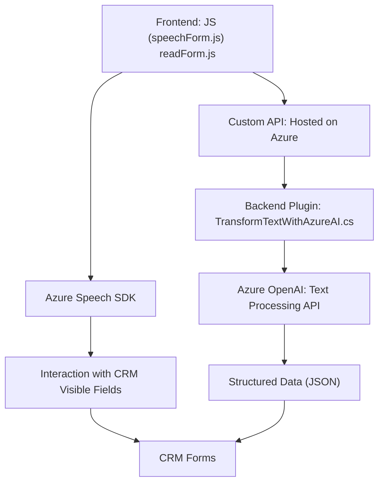

### Breve resumen técnico

El análisis del repositorio revela una implementación multicapa basada en herramientas de Microsoft Dynamics CRM y Azure Speech/OpenAI para la interacción de formularios por medio de entrada de voz. Se combinan módulos frontend, plugins backend, y dependencias externas (servicios Azure) para construir un sistema integral con enfoque en accesibilidad, procesamiento de datos dinámicos y actualización automática de formularios.

### Descripción de la arquitectura
El sistema tiene una arquitectura **n-capas** o **modular**, ampliada con patrones que conectan servicios de inteligencia artificial (Azure Speech/OpenAI) y CRM, que también puede interpretarse como parte de un diseño de microservicios debido a las dependencias y modularidad del plugin y custom APIs externos.
1. **Frontend Layer:** Procesa entrada de voz y datos del usuario mediante el SDK de Azure Speech, actualizando dinámicamente formularios CRM.
2. **API/External Services Layer:** Ofrece servicios externos vía Azure OpenAI (procesamiento de texto vía IA), además de proporcionar mecanismos de autenticación segura.
3. **Business Logic Layer:** Plugins como `TransformTextWithAzureAI.cs` operan la lógica de transformar texto en estructuras compatibles con el CRM usando reglas específicas.
4. **Persistence and CRM Layer:** Integración directa con Microsoft Dynamics para manejar campos visibles y atributos de los formularios.

### Tecnologías usadas
1. **Frontend:**
   - **JavaScript.**
   - **Azure Speech SDK**: Para reconocimiento de voz y síntesis de texto a voz.
   - **Dynamics CRM APIs**: Administración de formularios (`Xrm.WebApi`, `executionContext`).

2. **Backend/Plugins:**
   - **C#**: Base de los plugins para ejecutar transformaciones de texto.
   - **Azure OpenAI Service**: IA para procesamiento y estructura de texto.
   - **Microsoft Dynamics SDK**: Para acceder y manipular datos en CRM.

3. **Protocolos y herramientas auxiliares:** 
   - **Promesas y async/await**: Para operaciones asíncronas en manejo de API.
   - **RegEx**: Procesamiento de texto (por ejemplo, para normalización).
   - **Newtonsoft JSON**: Serialización/deserialización de datos JSON.
   - **API REST de Azure**: Conexión directa con servicios de IA hospedados.

### Diagrama **Mermaid** válido para GitHub

### Conclusión final
La solución global implementada combina **modularidad** y **servicios externos** (Azure Speech/OpenAI) para crear una experiencia de accesibilidad y automatización en formularios de Dynamics CRM. Su arquitectura basada en capas garantiza separación de las responsabilidades:
1. **Entrada/Formulario (Frontend)**: Procesa la interacción usuario-sistema (reconocimiento/síntesis de voz).
2. **Middleware/API**: Interpreta y transforma datos a nivel de IA, con integración dinámica.
3. **CRM Plugins**: Extiende funcionalidad base de Dynamics CRM vía procesamiento personalizado.

El sistema es eficiente para manejo de accesibilidad en entornos empresariales y muestra extensibilidad hacia nuevas aplicaciones en CRM y análisis de datos, manteniendo modularidad y aprovechando servicios de IA.