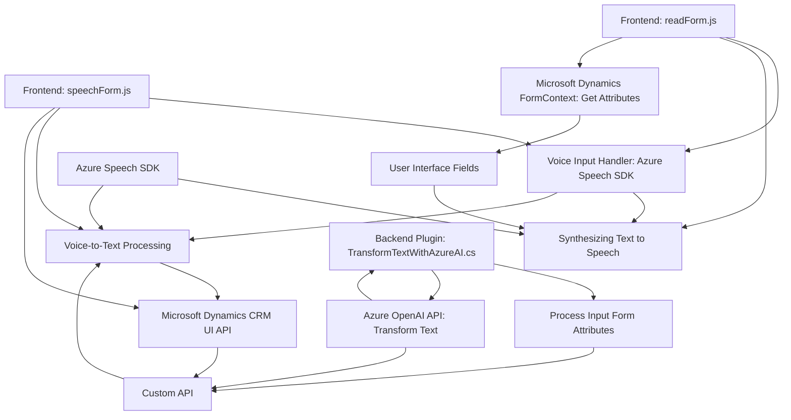

### Breve resumen técnico:
El repositorio presenta una solución que integra procesamiento de voz y texto en formularios de Microsoft Dynamics CRM usando tecnologías de Azure, como Speech SDK y OpenAI. Se divide en frontend basado en JavaScript y un backend (en forma de plugins en C#, específico para Dynamics CRM).

---

### Descripción de arquitectura:
La arquitectura orientada a capacidades pone énfasis en:
1. **Frontend**:
   - Modularidad: Archivos como `readForm.js` y `speechForm.js` definen funcionalidades específicas. 
   - API y SDK dinámica: Los scripts interactúan con el Azure Speech SDK en el navegador para voz a texto y texto a voz.
   - Integración con Dynamics CRM: Manipulación de formularios mediante APIs de Dynamics (`formContext`, `executionContext`).

2. **Backend**:
   - Plugin basado en eventos: En `TransformTextWithAzureAI.cs`, el plugin responde a eventos del CRM y utiliza servicios externos (Azure OpenAI) para transformar texto.

3. La arquitectura adoptada tiene características de un **sistema en capas combinado con una arquitectura orientada a eventos**:
   - **Capa de presentación**: Interacción entre usuarios y formularios (frontend).
   - **Capa lógica o de aplicación**: Procesamiento de datos mediante SDK e IA (backend).
   - **Servicios externos**: Integración con Azure Speech y OpenAI.

El sistema descentraliza responsabilidades, creando un flujo de trabajo donde el frontend se conecta con SDKs externos y el backend gestiona eventos complejos del CRM.

---

### Tecnologías usadas:
1. **Frontend:**
   - JavaScript: Principal lenguaje del lado cliente para formularios y SDK.
   - Azure Speech SDK: Para síntesis y reconocimiento de voz.
   - Dynamics CRM APIs: Manipulación de campos y formularios.
2. **Backend:**
   - C# (.NET Framework): Implementación del plugin.
   - Azure OpenAI: API para transformación basada en IA.
   - Newtonsoft.Json: Manejo de datos JSON.
3. **Integraciones:**
   - HTTP REST APIs: Para comunicarse con Azure Speech SDK y OpenAI.

### Patrones utilizados:
1. **Callback pattern**: Especialmente en el frontend para cargar dinámicamente SDKs y manejar estados asincrónicos.
2. **Facade Pattern**: Centralización de operaciones mediante funciones que ocultan la complejidad de llamadas internas.
3. **Single Responsibility Principle (SRP)**: En `TransformTextWithAzureAI.cs`, las funciones tienen roles específicos.
4. **External API integration**: Uso extendido de capacidades externas (SDKs y OpenAI).

---

### Diagrama Mermaid 100 % compatible con GitHub Markdown:

---

### Conclusión final:
**Tipo de solución:** El proyecto representa una solución híbrida de frontend y backend que implementa interacción basada en reconocimiento de voz, síntesis de voz y transformación de contenido con IA en Microsoft Dynamics CRM. 

**Arquitectura:** Se trata de una arquitectura de sistema en capas combinada con características event-driven. Las capas están bien separadas, con el frontend funcionando como intérprete de voz/datos y el backend utilizando plugins para tareas avanzadas.

**Escenarios de uso:** Es ideal para entornos CRM que requieren la habilitación de interfaces de voz y texto basadas en IA para mejorar la recopilación y procesamiento de datos.

