### Breve resumen técnico:
El repositorio analiza una solución híbrida que integra frontend con funcionalidades de voz mediante el **Azure Speech SDK** en JavaScript, y extensibilidad de Microsoft Dynamics CRM mediante un plugin en C#. Orientada hacia la interacción del usuario con un sistema basado en formularios, incluye servicios avanzados de reconocimiento y síntesis de voz, además de integración con **Azure OpenAI** para procesamiento del lenguaje natural.

---

### Descripción de Arquitectura:
La solución tiene una arquitectura híbrida basada en **event-driven components** y diseñada en capas. La capa de presentación se implementa en JavaScript y se conecta directamente con **Dynamics 365** y los servicios de **Azure Speech SDK** y **Azure OpenAI**. En la capa backend, se encuentra un plugin que extiende la funcionalidad de Dynamics 365 conectándose con el servicio externo de Azure OpenAI mediante solicitudes REST para procesamiento de lenguaje.

Arquitectura global:
- Frontend: Desarrollado en JavaScript, con interacción directa con la capa de presentación y servicios externos (Azure Speech SDK, Dynamics).
- Backend: Extensión de Dynamics CRM mediante un plugin en C# integrado con Microsoft APIs y Azure OpenAI.

---

### Tecnologías usadas:
1. **Frontend**:
   - **JavaScript**: Desarrollado para manejar la interacción con los formularios mediante voz y sintetizar texto vía SDK de Azure Speech.
   - **Azure Speech SDK**: Utilizado para síntesis y reconocimiento de voz (en tiempo real).
   - **Dynamics 365 SDK** (formContext): Usado como contexto del formulario donde se aplican los datos procesados.

2. **Backend**:
   - **C#**: Implementación del plugin para Dynamics CRM.
   - **Microsoft Dynamics CRM SDK**: Extensibilidad mediante plugins, manejo de parámetros de entrada/salida y contexto de ejecución.
   - **Azure OpenAI Service**: External API utilizada para transformar texto en JSON estructurado.
   - **Librerías .NET**: `Newtonsoft.Json`, `System.Net.Http` (para JSON y llamadas HTTP).

---

### Diagrama **Mermaid**:

```mermaid
graph TD
A["Frontend"] --> B["JS Archivo: readForm.js"]
A --> C["JS Archivo: speechForm.js"]

B --> D["Función startVoiceInput - Usa Speech SDK"]
B --> E["Función leerFormulario"]
B --> F["Función getVisibleFieldData - Extrae campos visibles"]
B --> G["Función speakText - Sintetiza voz con Speech SDK"]
B --> H["Dependencias: Azure Speech SDK y Dynamics form context"]

C --> I["Función startVoiceInput - Usa Speech SDK"]
C --> J["Función ejecutarGrabacion - Reconoce voz con Speech SDK"]
C --> K["Función callCustomApi - Invoca a Dynamics API personalizada"]
C --> L["Función processTranscript - Procesa comandos (sin IA)"]
C --> M["Función processTranscriptIA - Procesa comandos con JSON de IA"]
C --> N["Dependencias: Speech SDK y Xrm.WebApi"]

A --> O["Interacción directa con Dynamics 365"]
O --> P["Integración de atributos del formulario"]

Q["Backend"] --> R["C# Archivo: TransformTextWithAzureAI.cs"]
R --> S["Método Execute - Plugin principal Interfaz IPlugin"]
R --> T["Método GetOpenAIResponse - Interfaz REST API de Azure OpenAI"]
R --> U["Dependencias: Microsoft Dynamics SDK y Azure OpenAI"]

O --> V["Deployment en Dynamics 365"]
```

---

### Conclusión final:
Esta solución describe un **ecosistema de integración avanzada entre Azure y Dynamics 365**, dando lugar a una arquitectura híbrida con una interacción cercana entre el frontend y los servicios en la nube. Su arquitectura sigue principios de **event-driven design** y modularidad, permitiendo una buena separación de lógica en capas. Se observa un enfoque hacia servicios externos como el **Azure Speech SDK** y **Azure OpenAI API**, destacando la escalabilidad y la capacidad de integrar tecnologías de IA en sistemas empresariales.

En términos de mejora, se podría implementar gestión dinámica de credenciales para las API del servicio de Azure OpenAI, evitar configuraciones estáticas y fortalecer la seguridad del plugin en el backend.