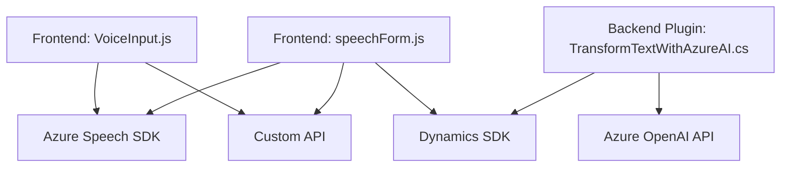

### Breve resumen técnico

El repositorio parece ser parte de una solución que interactúa con Dynamics CRM y Azure services, usando voz y texto como medio de entrada/salida para proporcionar una experiencia enriquecida. Consiste en archivos que procesan formularios en la interfaz frontend, transforman texto con inteligencia artificial mediante Azure services, e interactúan con Dynamics CRM como plugins.

---

### Descripción de arquitectura

La arquitectura utilizada en esta solución se puede clasificar como **multicapa** en un entorno de cliente-servidor.

- **Frontend Layer:** Funcionalidades en JavaScript permiten el ingreso de datos desde formularios y el procesamiento por voz (Voice-to-text y Text-to-speech). Este cliente comunica y recibe datos con APIs externas (Azure Speech SDK y Custom APIs) en una arquitectura de **Event-Driven**.
  
- **Business Logic Layer (Server/Backend):** El backend en C# se integra con Dynamics CRM a través de plugins y con servicios externos como Azure OpenAI para ejecutar transformaciones de texto y manejar datos desde las interacciones de formularios del usuario.

- **Integration Layer:** La solución tiene componentes integrados con `Azure Speech SDK` y `Azure OpenAI API`.

---

### Tecnologías usadas

1. **Frontend:** 
   - JavaScript.
   - Azure Speech SDK (carga dinámica mediante CDN).
   - DOM API para manipulación del formulario.

2. **Backend (Plugins):**
   - C#/.NET Framework.
   - Dynamics CRM SDK (`IPlugin`, `Microsoft.Xrm.Sdk`).
   - HTTP Client para integración con servicios de APIs externas.
   - Newtonsoft.Json y System.Text.Json para manejo de JSON.

3. **Servicios externos:**
   - Azure Speech SDK (para síntesis de voz y reconocimiento de voz).
   - Azure OpenAI API (para transformación de texto en JSON estructurado).

4. **Patrones arquitectónicos:** 
   - **Modular:** Las funciones están separadas según sus propósitos específicos.
   - **Event-Driven:** Basado en eventos de formularios o acciones del usuario como interacción por voz.
   - **Integration:** Uso extensivo de SDKs y APIs entre plataformas (Azure Speech y Azure OpenAI).
   - **Multicapa:** Separación clara entre el frontend (captura de datos y voz), la lógica de negocio (procesamiento en plugins), y la integración de APIs externas.

---

### Diagrama **Mermaid**

### Conclusión final

La repositorio analizado parece ser una solución **multicapa** que permite la integración del procesamiento de entrada/salida de voz mediante el SDK de Azure Speech y la transformación de datos con Azure OpenAI en escenarios de formularios gestionados por Dynamics CRM. Los métodos y funciones están distribuidos entre la capa de presentación (JavaScript), la capa de negocio (C# Plugin), y la capa de integración (API externa y SDKs).

Por su estructura modular y su diseño basado en eventos, la solución presenta una arquitectura limpia que abstrae responsabilidades entre componentes. Sin embargo, aspectos como el manejo explícito de errores, validaciones de entrada rigurosas y posibles dependencias innecesarias en el plugin podrían ser áreas de mejora.