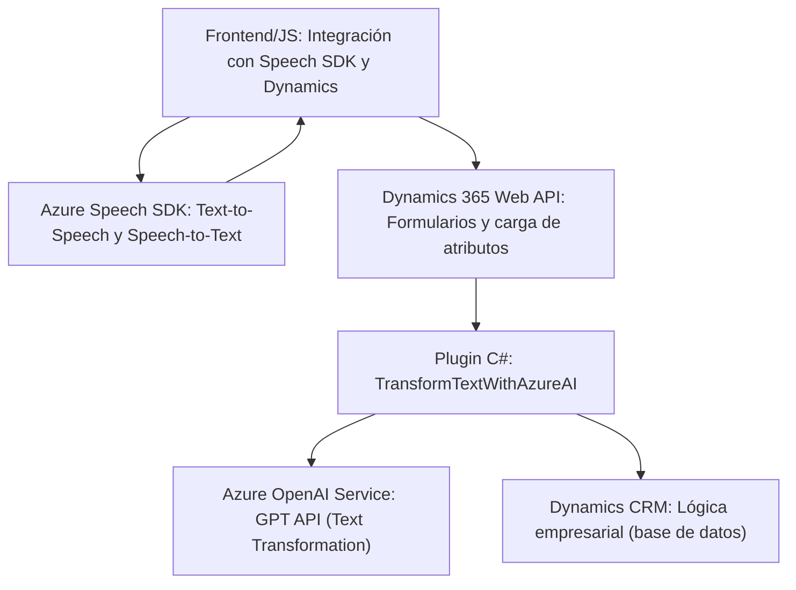

### **Análisis técnico del repositorio**

#### **1. Qué tipo de solución es**
El repositorio parece ser una solución híbrida orientada a automatizar operaciones en Microsoft Dynamics 365, con las siguientes componentes principales:
- **Frontend**: Archivos JavaScript interactúan directamente con formularios de Dynamics 365 en el frontend, proporcionando capacidades de reconocimiento de voz (speech-to-text) y síntesis de voz (text-to-speech).
- **Backend/Plugin**: Un archivo C# implementa la lógica del backend como un **plugin para Dynamics CRM**, permitiendo transformar texto mediante Azure OpenAI Service.

#### **2. Tecnologías, frameworks y patrones usados**
**Tecnologías:**
- Node.js/JavaScript para desarrollo de frontend.
- C# y **Dynamics SDK** para desarrollo de plugins backend.
- **Azure Services**:
  - **Azure Speech SDK**: Reconocimiento y síntesis de voz.
  - **Azure OpenAI Service (GPT)**: Transformación de texto.
- **Dynamics 365 Web API**: Integración y manipulación de formularios y datos.

**Patrones:**
- **Modularidad**:
  - Código JavaScript y C# organizado por funciones para realizar tareas en silos.
- **Integración con servicios externos**:
  - Usa servicios de Azure (Speech y OpenAI) acoplados mediante APIs.
- **Separación de roles**:
  - Frontend: gestión de voz, lectura de formularios e integración básica.
  - Backend: manejo de texto estructurado según reglas específicas.
- **Callback de eventos**:
  - Utilización de callbacks en JavaScript para la carga y validación de SDK externos.

#### **3. Qué tipo de arquitectura tiene**
La arquitectura sigue un enfoque híbrido con características específicas:
- **Frontend/Middle layer**: Los archivos JavaScript actúan como una capa de interacción entre los usuarios y los formularios de Dynamics 365.
- **N-Capas** (en el backend):
  - Integración con Dynamics CRM como capa cliente.
  - Lógica empresarial segregada a través del plugin C#.
  - Dependencia de servicios externos de Azure para manejar API (speech-to-text y GPT).
- **Acoplamiento de Microservicios**:
  - Servicios como Azure Speech/API trabajan independientemente, interactuando a través de APIs.

#### **4. Qué dependencias o componentes externos podrían estar presentes**
El código depende significativamente de:
1. **Servicios de Azure**:
   - Speech SDK para reconocimiento/síntesis de voz.
   - OpenAI Service para transformación avanzada del texto.
2. **Dynamics CRM SDK/APIs**:
   - Manipulación y lectura de formularios y entidades.
3. **Librerías complementarias**:
   - Librerías de manejo de JSON (`System.Text.Json`, `Newtonsoft.Json.Linq`).
4. **Navegador/DOM**:
   - En el frontend, el JavaScript interactúa con el navegador y DOM.

---

### **Diagrama Mermaid**

A continuación, un diagrama representativo de la interacción entre las partes del sistema:

---

### **Conclusión final**
Este repositorio implementa una solución bien integrada para Dynamics CRM que potencia funcionalidades avanzadas utilizando servicios de Azure (Speech, OpenAI) y facilita la interacción mediante automatización y manipulación de formularios con voz. La arquitectura combina patrones de separación lógica (N capas) con integración de microservicios externos, lo que permite una extensión funcional específica sin redundancia en el desarrollo.

Si bien está orientado a Dynamics CRM, la arquitectura modular facilita la potencial reutilización de los componentes (p. ej., los módulos de reconocimiento de voz y transformación de texto) en otros contextos, consolidando un diseño flexible y escalable.