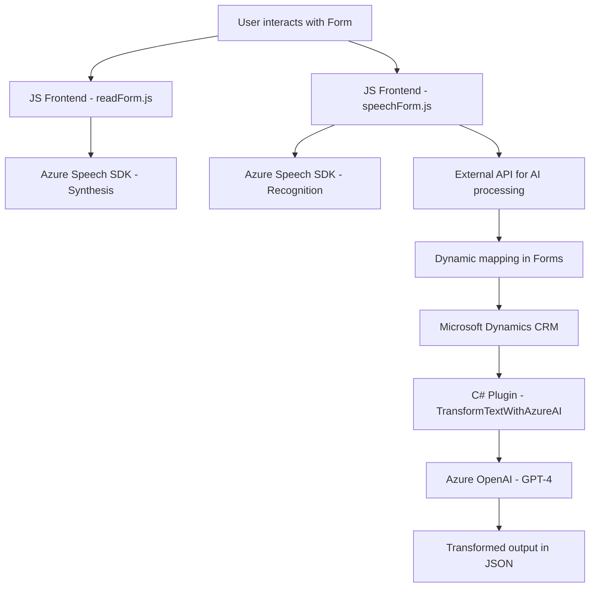

### Breve resumen técnico
El repositorio contiene tres archivos relacionados con la captura y transformación de datos de formularios y la síntesis/reconocimiento de voz utilizando **Azure Cognitive Services** (Azure Speech SDK) y **Azure OpenAI**. Los módulos están diseñados principalmente para integrarse con **Microsoft Dynamics CRM**, utilizando técnicas como transcripción de voz, procesamiento de texto optimizado con IA y estructura modular de plugins para operaciones específicas.

---

### Descripción de arquitectura
La solución tiene una arquitectura **híbrida**, donde cada módulo juega un rol específico:

1. **Frontend**: Proporciona lógica basada en JavaScript para capturar datos de formularios y realizar reconocimiento/síntesis de voz. Utiliza patrones independientes (funciones modularizadas) para interactuar con formularios y SDK externos.
2. **Plugins**: Los componentes backend (C#) implementan un patrón de **Plugin** diseñado para Dynamics CRM. Este plugin utiliza servicios externos (API de Azure OpenAI) para transformar texto siguiendo reglas específicas.
3. **Integración con CRM**: La solución interactúa directamente con Dynamics CRM mediante formularios, conteniendo lógica personalizada para campos en tiempo real.

La arquitectura puede ser clasificada como **n capas**, donde cada capa (Frontend/SDK Externo, Dynamics CRM, Azure APIs) cumple claramente tareas diferenciadas. Sin embargo, tiene elementos de una arquitectura **extensible/modular** con integración de microservicios para determinadas tareas (procesos IA, APIs externas).

---

### Tecnologías usadas
1. **Frontend**:
   - **Lenguaje**: JavaScript.
   - **SDK**: Azure Speech SDK.
   - **Frameworks**: Dynamics CRM (contexto de formularios).
   - **API personalizada**: Interacciones con Dynamics APIs y Azure para reconocimiento/transformación.

2. **Backend**:
   - **Lenguaje**: C#.
   - **SDK**: Azure OpenAI (GPT-4).
   - **Frameworks**: Dynamics CRM SDK.
   - **HTTP Client libraries**: `System.Net.Http` y `Newtonsoft.Json.Linq` para manipulación JSON y solicitudes a servicios Azure.

3. **Patrones**:
   - **SDK dinámico**: Carga dinámica del SDK (Speech SDK) en el frontend.
   - **Plugin-based architecture**: Para integración con Dynamics CRM.
   - **Modularización**: Separación estricta de responsabilidades por funciones tanto en frontend como en backend.
   - **Promesas**: Uso de asincronía en JavaScript y APIs dinámicas.

---

### Dependencias o componentes externos
1. **Azure Speech SDK**: Para reconocimiento y síntesis de voz.
2. **Azure OpenAI (GPT-4)**: Transformación avanzada de texto utilizando IA.
3. **Dynamics CRM Framework**: Contextos de formularios, APIs para manipulación de datos en formularios y plugins CRM.
4. **Bibliotecas populares**:
   - `Newtonsoft.Json.Linq`: Procesamiento JSON avanzado en C#.
   - `System.Net.Http`: Para ejecución de solicitudes HTTP/HTTPS desde plugins.

---

### Diagrama Mermaid válido para GitHub

---

### Conclusión final
La solución es una **hybrid-web architecture** consistente en módulos frontend y backend, eficientemente separados para admitir la captura y transformación de datos en un entorno dinámico como Dynamics CRM. Utiliza tecnologías como **Azure Speech SDK**, **Azure OpenAI** y componentes del SDK de Dynamics CRM para ofrecer capacidades avanzadas de voz e inteligencia artificial.

El diseño modular asegura que los componentes sean extensibles, mientras que la integración con APIs externas fortalece el enfoque de arquitectura n-capas con soporte para microservicios específicos.