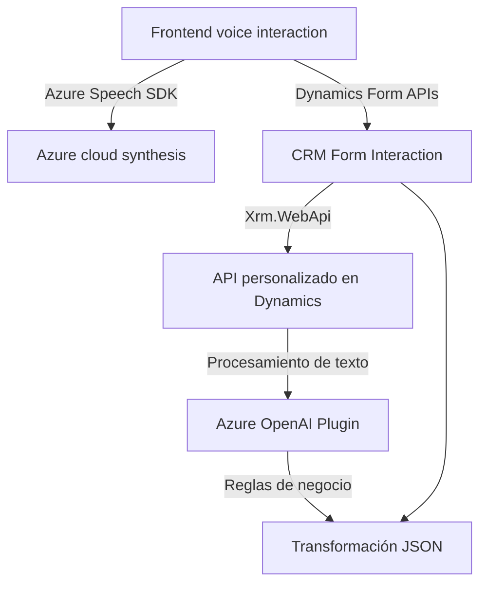

### Resumen técnico del análisis:

El repositorio sugiere una integración fluida entre funcionalidades de frontend (procesamiento de formularios con voz e interacción de usuarios) y backend (plugin en Dynamics 365 con procesamiento en Azure OpenAI). Se maneja un enfoque modular que promueve la reutilización de componentes y facilita la escalabilidad. Las dependencias externas clave son **Azure Speech SDK**, **Dynamics 365 APIs**, y **Azure OpenAI**, evidenciando fuerte soporte para escenarios empresariales y cloud computing.

---

### Descripción de arquitectura:

1. **Tipo de solución**: Esta es una solución compuesta:
   - **Frontend**: Implementa funcionalidades interactivas, como el reconocimiento de voz, síntesis de audio y llenado de formularios dinámicos.
   - **Plugins** (backend): Automatización empresarial mediante el uso de Dynamics 365 y la integración con Azure OpenAI para transformación de datos.

2. **Tipo de arquitectura**:
   - **Microservicios acoplados**: Los componentes tienen cierto grado de independencia (por ejemplo, frontend interactivo y plugin Dynamics) pero comparten dependencias cruciales como Azure Speech y Dynamics 365 APIs.
   - El frontend sigue una **arquitectura modular** con separación de responsabilidades clara por función (`leerFormulario`, `procesarTranscript`).
   - El plugin implementa un **patrón en capas** al delegar las solicitudes HTTP (Azure OpenAI) y mantener las reglas de negocio dentro del contexto de ejecución CRM.

3. **Patrones principales**:
   - **Facade pattern**: Los puntos de entrada como `startVoiceInput` simplifican la interacción con toda la funcionalidad interna.
   - **Modulo dinámico**: Funciones para carga de SDK externo.
   - **Mapper Pattern**: Uso explícito de mapeos entre campos visibles y atributos del formulario.
   - **Callback-based asynchronous flow** para operaciones de voz y API Dynamics.

---

### Tecnologías usadas:

1. **Frontend**:
   - **Frameworks/Librerías**: Microsoft Dynamics 365 APIs (Xrm.WebApi), Azure Speech SDK.
   - **Lenguaje**: JavaScript.
2. **Backend**:
   - **Librerías principales**: 
     - C# con Dynamics CRM SDK (e.g., `IPluginExecutionContext`)
     - Integración con Azure OpenAI API mediante `System.Net.Http`.
     - Manejo JSON con `Newtonsoft.Json.Linq`.

---

### Dependencias externas:

1. **Azure Speech SDK**: Para síntesis y reconocimiento de voz.
2. **Microsoft Dynamics 365 SDK (WebApi plugin)**: Management de datos en los formularios CRM.
3. **Azure OpenAI REST API**: Procesamiento de texto avanzado.
4. **Librerías estándar**:
   - `System.Net.Http` para solicitudes hacia Azure OpenAI.
   - `Newtonsoft.Json.JsonConvert` para serialización.
   - Gestión de formularios dinámicos mediante `frontContext` APIs.

---

### Diagrama **Mermaid**:

El siguiente diagrama representa la relación entre los componentes (frontend, backend y dependencias externas):

---

### Conclusión final:

El repositorio combina características modernas de interacción con voz en un frontend en JavaScript utilizando Azure Speech SDK, con capacidades empresariales en un plugin backend que aprovecha Azure OpenAI y Dynamics CRM. La arquitectura es modular, con patrones bien definidos como **facade** y **mapping**, proporcionando extensibilidad fácil y uso de herramientas cloud. Esto lo convierte en una solución robusta para procesos empresariales digitales interactivos.