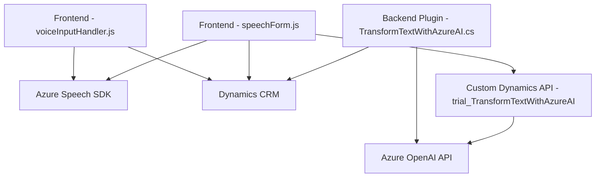

# Breve Resumen Técnico

El repositorio contiene tres componentes: dos scripts de frontend (`voiceInputHandler.js` y `speechForm.js`) y una clase de plugin en C# (`TransformTextWithAzureAI.cs`). Su objetivo principal es integrar funcionalidades de procesamiento de voz, reconocimiento de voz y transformación de texto mediante servicios de Azure (Speech SDK y Azure OpenAI) en entornos de Dynamics 365.

---

# Descripción de la Arquitectura

La solución utiliza una arquitectura en capas, donde cada componente cumple un rol específico:
1. **Frontend**: Scripts que interactúan con Azure Speech SDK para sintetizar texto en voz y convertir voz en texto; además, integran estos datos con el formulario de Dynamics 365.
2. **Servicios**: Comunicación entre scripts de frontend y APIs de Dynamics CRM, y llamadas a la API personalizada `TransformTextWithAzureAI`.
3. **Backend (Plugin)**: Plugin en C# en Dynamics 365 que transforma texto según reglas y utiliza Azure OpenAI para generar contenido estructurado.

Se trata de una arquitectura concentrada en servicios (Service-Oriented Architecture, SOA), donde cada capa interactúa de manera modular y desacoplada.

---

# Tecnologías Usadas

1. **Lenguajes**:
   - JavaScript (en frontend, para Azure Speech SDK y DOM interactions).
   - C# (en backend, para implementación de Dynamics CRM plugins).

2. **Frameworks y SDK**:
   - **Azure Speech SDK** (procesamiento de voz).
   - **Azure OpenAI Service** (transformación de texto mediante inteligencia artificial).
   - **Dynamics 365 API** (`Xrm.WebApi` y `IPluginExecutionContext`) para interacción directa con datos y lógica del sistema CRM.

3. **Patrones de Diseño y Arquitectura**:
   - **Carga dinámica de módulos**: Condicional en SDK externo como Speech SDK en JavaScript.
   - **Proxy Pattern**: Uso de intermediarios para procesamiento de datos en frontend (por ejemplo, `applyValueToField`) y backend (`GetOpenAIResponse`).
   - **Plugin Pattern**: En el backend del CRM para extensibilidad.
   - **Distribución por capas**: Dividiendo roles de frontend (interfaz/interacción), servicios (API externas) y backend (procesamiento lógico).

---

# Diagrama Mermaid

El siguiente diagrama muestra los flujos y dependencias de alto nivel entre los componentes y servicios:

---

# Conclusión Final

La solución funciona como un sistema modular basado en servicios donde el procesamiento de voz y texto se distribuye entre una capa de frontend, servicios de Azure y un backend conectado a Dynamics CRM. Los scripts aprovechan el Azure Speech SDK para sintetizar y reconocer voz, mientras que el plugin de C# procesa texto con Azure OpenAI para cumplir con reglas definidas. La arquitectura, aunque sencilla, está bien estructurada para aprovechar servicios en la nube desacoplados. 

Se recomienda vigilar la gestión segura de credenciales de las APIs de Azure y Dynamics CRM, especialmente en despliegues públicos. También, sería beneficioso considerar la integración de pruebas automatizadas para garantizar una experiencia consistente en el tiempo.