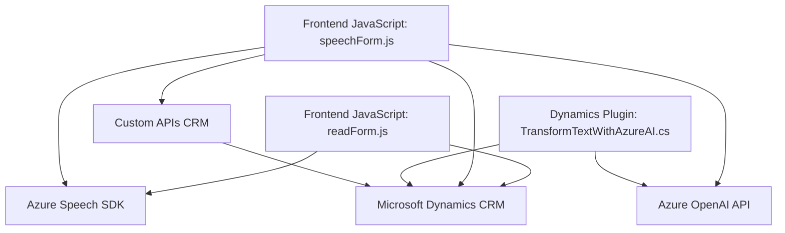

# Análisis técnico detallado

### Breve resumen técnico
El repositorio contiene tres archivos principales: dos de JavaScript (`readForm.js`, `speechForm.js`) y uno de C# (`TransformTextWithAzureAI.cs`). Estos archivos forman parte de una solución diseñada para integrar funcionalidades avanzadas de voz y transformación de texto con formularios CRM, utilizando Azure Speech SDK y OpenAI. Su propósito es permitir entradas de voz, síntesis de texto y transformación de datos mediante servicios externos como Dynamics CRM, Azure Speech Services y Azure OpenAI.

---

### Descripción de arquitectura
La arquitectura de la solución parece ser de **n capas** con integración hacia servicios externos como Azure AI y Dynamics CRM. 
1. **Frontend**:
   - Contiene lógica basada en JavaScript para interactuar con formularios, manejar visibilidad de campos, y enviar/recibir datos desde APIs.
   - Funciones como `ensureSpeechSDKLoaded` aseguran modularidad y manejo dinámico de dependencias.
   - Procesos son delegados y orientados a eventos (`startVoiceInput`, `ejecutarGrabacion`).
  
2. **Plugins Backend (Dynamics CRM)**:
   - Lógica específica para transformar texto y manejar solicitudes HTTP hacia Azure OpenAI.
   - Patrones típicos de integración con Dynamics CRM mediante plugins (`IPlugin`, `Execute`, contexto de servicio).

La solución actúa como puente entre sistemas locales (formulario CRM) y servicios externos (Azure Speech/OpenAI), siendo una **integración híbrida de servicios**.

---

### Tecnologías usadas
1. **Frontend**:
   - **JavaScript**: Es usado para definir lógica en el lado cliente y para integrar el servicio externo Azure Speech SDK.
   - **Azure Speech SDK**: Para síntesis de voz, reconocimiento y manejo de texto.
   - **Dynamics CRM Context (formContext)**: Mapea datos visibles de los formularios CRM.

2. **Backend**:
   - **C# Plugin para Dynamics CRM**: Extiende funcionalidad del CRM usando la librería `Microsoft.Xrm.Sdk` junto con servicios externos.
   - **Azure OpenAI API**: Manipula texto utilizando normas específicas.
   - **Microsoft's .NET Framework**: Requisitos del entorno plugin de Dynamics CRM.

---

### Dependencias o componentes externos que podrían estar presentes
1. **Azure Speech SDK**:
   - Es invocado en tiempo de ejecución desde una URL externa (`https://aka.ms/csspeech/jsbrowserpackageraw`).
   
2. **Azure OpenAI API**:
   - Para transformar texto, requiere solicitudes HTTP con autenticación mediante una API Key.

3. **Microsoft Dynamics CRM**:
   - La solución está altamente integrada con este sistema mediante los `formContext`, `Xrm.WebApi` y el uso de estructuras típicas del SDK (`Microsoft.Xrm.Sdk`).

4. **Newtonsoft.Json**: Para el manejo de JSON en el plugin C#.

5. **Servicios web internos personalizados**: Las API llamadas en el archivo `speechForm.js` (`callCustomApi`) sugiere presencia de endpoints personalizados para procesamiento de datos CRM.

---

### Diagrama Mermaid válido para GitHub Markdown

---

### Conclusión final
La solución se enfoca en mejorar la interacción entre usuarios y formularios CRM mediante la integración de reconocimiento de voz, lectura de datos visuales, síntesis de texto y transformación basada en IA. La arquitectura combina capas de procesamiento cliente (JavaScript) y servidor (C# plugin) con servicios de Azure. Aunque funcionalmente modular, la solución depende de múltiples puntos externos (Azure Speech/OpenAI, Dynamics CRM), lo que exige robustez en el manejo de errores y configuraciones de red.