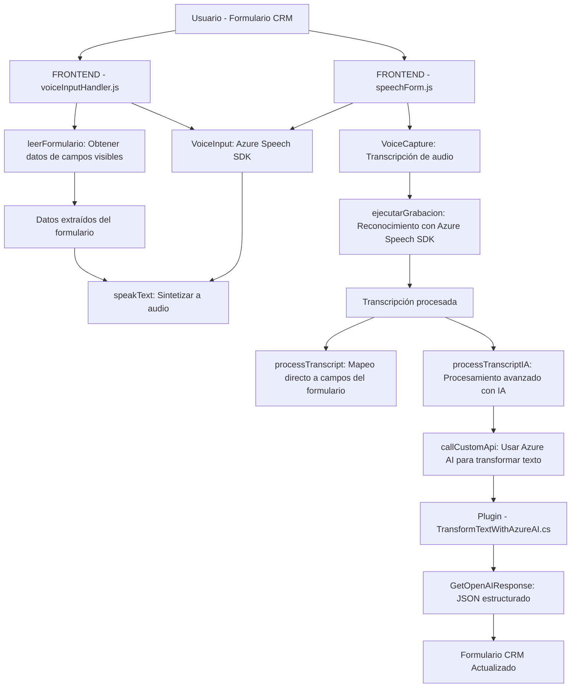

### Breve Resumen Técnico
El repositorio contiene tres componentes principales relacionados con la integración de voz, Inteligencia Artificial (IA) y manejo de formularios dentro de una solución que interactúa con **Microsoft Dynamics 365**. Los archivos implementan tanto lógica frontend (en JavaScript) como lógica backend (en C#) para habilitar entrada y salida de voz, mapeo dinámico de datos en formularios y procesamiento avanzado de texto mediante **Azure AI**. La solución utiliza APIs externas como **Azure Speech SDK** y **Azure OpenAI**.

---

### Descripción de Arquitectura
La arquitectura puede ser categorizada como **n-capas orientadas a servicios**:
1. **Frontend (Cliente):**
   - Implementa la integración de entrada/salida de voz, manejo de formularios en Dynamics, y captura/transcripción de datos.
   - Usa el **Azure Speech SDK** para reconocer voz y sintetizar texto a audio.
2. **Backend (API/Plugins en Dynamics 365):**
   - Plugins en C# que procesan texto y transfieren datos a través de **Azure OpenAI**.
   - Realiza validaciones, transformación de texto en objetos JSON estructurados, y devuelve resultados al sistema principal (Dynamics CRM).

### Tecnologías y Patrones Usados
#### Tecnologías:
- **Frontend:** JavaScript, Dynamics 365 API.
- **Backend:** C# (.NET Framework), Microsoft Dynamics SDK, Azure OpenAI API.
- **Integraciones:** Azure Speech SDK, Azure ChatGPT, Dynamics WebAPI.

#### Patrones:
- **Integración con APIs externas:** Uso de SDKs como el Azure Speech SDK y el API de Azure OpenAI para ampliar funcionalidades sin desarrollar soluciones propietarias.
- **Cargador dinámico:** Los archivos JavaScript implementan cargadores dinámicos para verificar y cargar dependencias cuando son necesarias, mejorando la eficiencia.
- **Encapsulación funcional:** El código está dividido en módulos claros y reutilizables con responsabilidades específicas.
- **Event-handler (Backend):** El plugin sigue el modelo extensible de Dynamics 365 al reaccionar a eventos dentro del contexto del CRM.
- **Procesamiento y delegación:** Tanto el frontend como el backend delegan responsabilidades complejas a servicios externos como OpenAI y Speech SDK.

---

### Dependencias y Componentes Externos
1. **Azure Speech SDK:**
   - Proporciona funcionalidades avanzadas de reconocimiento de voz y síntesis de audio.
   - Cargado dinámicamente en el entorno browser.
2. **Dynamics WebAPI:**
   - Permite la comunicación y actualización de datos a nivel de formularios CRM (mapeo directo de campos).
3. **Azure OpenAI API:**
   - Para transformar texto de entrada y proporcionar un JSON estructurado.
4. **Microsoft Dynamics SDK:**
   - Habilita el desarrollo de plugins y proporciona herramientas para interactuar con el sistema CRM.
5. **Librerías C# (p.ej., `System.Text.Json` y `HttpClient`):**
   - Para realizar solicitudes HTTP y manejar la serialización/deserialización de objetos JSON.

---

### Diagrama **Mermaid** Válido para **GitHub**

---

### Conclusión Final
La solución implementa una arquitectura moderna de **n-capas** con integración a servicios externos como **Azure Speech SDK** y **Azure OpenAI API**. El diseño se enfoca en modularidad y encapsulación tanto en el frontend como en el backend, además de soportar la automatización y interacción avanzada con formularios de Dynamics 365. La combinación de reconocimiento de voz, síntesis de texto y procesamiento basado en IA demuestra que se trata de una solución innovadora para ampliar las capacidades de gestión en el contexto de CRM.