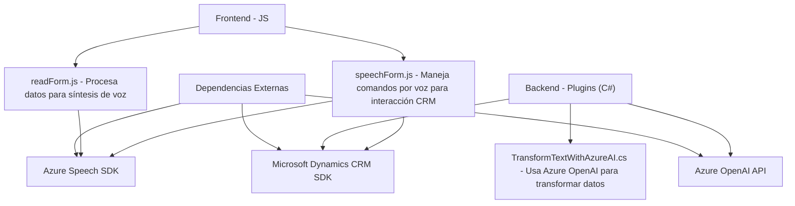

### Breve Resumen Técnico
El repositorio proporciona una solución estructurada para integrar funcionalidades avanzadas con formularios de un sistema CRM basado en Microsoft Dynamics. Los principales objetivos son:
1. Facilitar interacciones basadas en voz (captura de comandos verbales y síntesis de texto).
2. Transformar datos utilizando APIs de Azure AI para enriquecer el procesamiento de información.
3. Automatizar tareas en el CRM como actualización de campos y procesamiento de datos relacionados.

### Descripción de Arquitectura
La arquitectura es **modular**, con una integración directa entre distintas capas:
- **Frontend:** Interacción principal construida en JavaScript. Se enfoca en formularios y comandos de voz procesados localmente o mediante APIs.
- **CRM Plugins:** Código en C# diseñado como plugins para Microsoft Dynamics CRM, destinado a manejar datos y extender funcionalidades conectadas.
  
El diseño sigue un patrón **n-capas**, dividiendo claramente la lógica de negocio (en plugins y archivos JS) y las dependencias externas (Azure Speech SDK y Azure OpenAI). En el caso de los plugins, la arquitectura presenta una integración típica basada en eventos de Dynamics CRM.

### Tecnologías Usadas
1. **Frontend:**
   - **JavaScript:** Para manipulación de interacción con formularios, procesamiento de datos y lógica de entrada/salida.
   - **Azure Speech SDK:** Usado para captura y reproducción de comandos por voz.
   
2. **Backend/CRM Plugins:**
   - **C# con Dynamics CRM SDK:** Para crear plugins que se ejecutan directamente en el contexto del CRM.
   - **Azure OpenAI API:** Usada en los plugins para procesar datos personalizados en formato JSON.

3. **Frameworks/Servicios:**
   - **Microsoft Dynamics CRM:** Presenta integración con formularios CRM utilizando `executionContext`.
   - **Azure:** Funciona como la capa de servicios externos.
   - **REST APIs (Azure Speech SDK y Azure OpenAI):** Utilizadas para manejar las operaciones de voz e inteligencia artificial.

### Dependencias o Componentes Externos
- **Azure Speech SDK:** Manejo de síntesis y reconocimiento de voz.
- **Azure OpenAI:** Procesamiento avanzado de texto y generación de JSON estructurado.
- **Microsoft Dynamics CRM SDK:** Para integrar la lógica de negocio con el formulario CRM.
- **APIs Internas/Externas del CRM:** Posiblemente configuradas para interacciones con entidades o búsquedas.

### Diagrama Mermaid (100 % compatible con GitHub Markdown)

### Conclusión Final
El repositorio presenta una arquitectura orientada a soluciones empresariales en un entorno CRM utilizando capacidades modernas de IA y voz. Tiene un diseño modular basado en n-capas y aprovecha patrones como **Facade** y **Event-driven** para encapsular la lógica de negocio. Aunque el código está bien estructurado, podría beneficiarse de una mayor separación de responsabilidades y de aplicar patrones como **Hexagonal Architecture** para facilitar pruebas y extensibilidad.