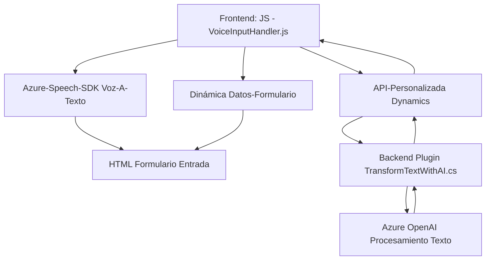

### Breve Resumen Técnico:
El repositorio contiene tres componentes principales dirigidos a la integración de comandos por voz y procesamiento de texto mediante APIs externas (Azure Speech SDK y Azure OpenAI) y su vinculación con formularios interactivos en Dynamics CRM. Los archivos cumplen funciones específicas dentro de una arquitectura modular y orientada a servicios, aprovechando tecnologías modernas basadas en eventos, promesas y servicios en la nube.

---

### Descripción de Arquitectura:
La arquitectura del sistema apunta hacia una **arquitectura multicapa n capas** con elementos de integración de microservicios. Estos son los factores clave para identificarla:
1. **Capa Frontend JS:** Provee la lógica para procesar formularios, integrar comandos de voz, y consumir APIs desde el lado del cliente (JavaScript).
2. **Capa Backend Plugins:** Funciona como intermediario dentro del ecosistema de Dynamics CRM para integrar servicios externos como Azure OpenAI, procesando datos y devolviendo estructuras JSON utilizando entradas predefinidas del sistema.
3. **Integración con APIs Externas:** Tanto el frontend como el plugin en backend consumen servicios de Azure para reconocimiento de voz y procesamiento de texto, adoptando un enfoque centrado en microservicios.

La separación de funciones y dependencias sugiere una arquitectura escalable que combina integración directa con servicios basados en "Software-as-a-Service" (SaaS) y adaptación al ecosistema de Dynamics CRM.

---

### Tecnologías Usadas:
1. **Azure Speech SDK:** Procesamiento de síntesis y reconocimiento de voz.
2. **Azure OpenAI API:** Generación de texto basado en inteligencia artificial.
3. **Dynamics 365 CRM Web API:** Para la manipulación de formularios, llamadas a APIs personalizadas y manejo de datos.
4. **Lenguajes de programación:**
   - **JavaScript:** Para manipulación de formularios en Dynamics 365.
   - **C#:** Para desarrollo de plugins integrados en Dynamics CRM.
5. **Frameworks y Librerías:**
   - `Newtonsoft.Json`: Para manipulación eficiente de JSON.
6. **HTTP Request Libraries:** Consumo de APIs externas utilizando `System.Net.Http`.

---

### Diagrama Mermaid:

---

### Conclusión:
Este repositorio describe una solución híbrida que conecta funcionalidades de reconocimiento de voz y generación de texto en aplicaciones web sobre Dynamics CRM. La arquitectura modular de n capas combina la asincronía de controladores JavaScript para la interfaz de usuario y plugins C# para procesamiento avanzado en el backend. El uso de los patrones de diseño como "event-driven" y "service integration" muestra que el sistema ha sido diseñado para ser escalable y extenderse a diferentes escenarios sin modificar sus componentes principales.