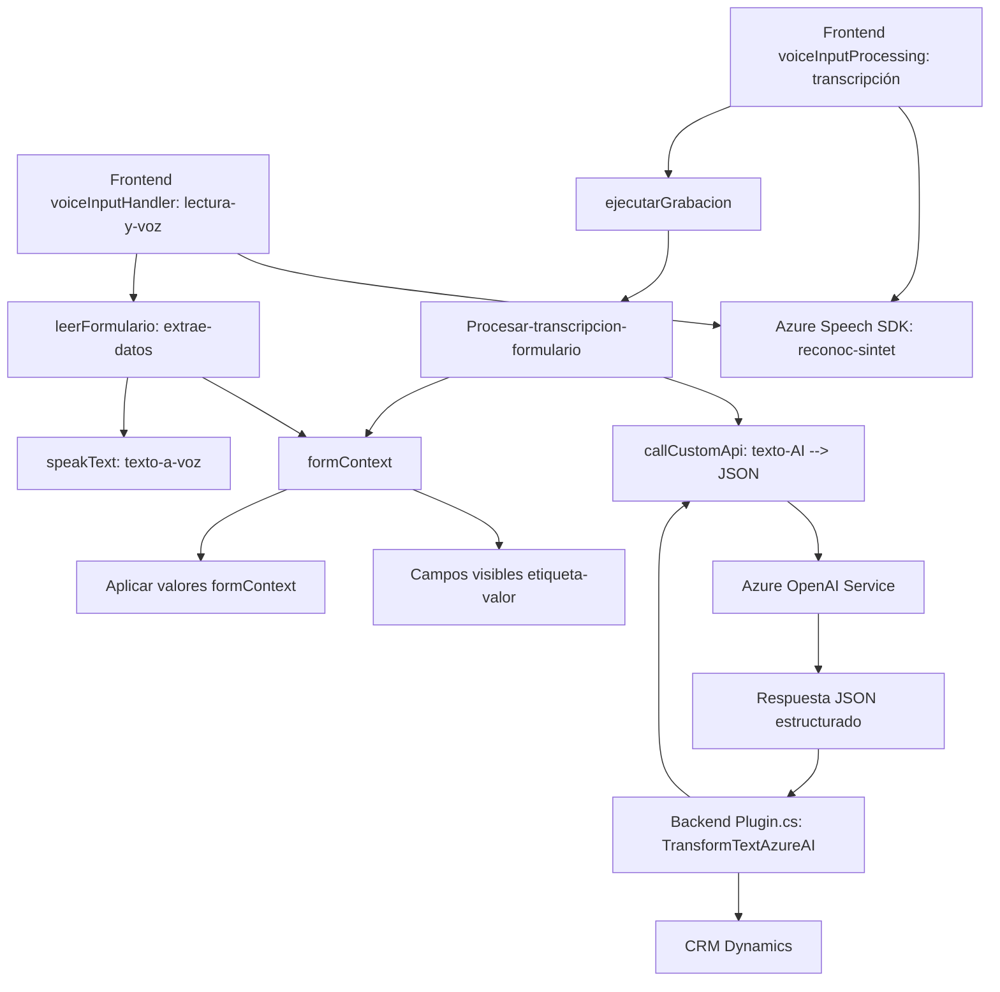

### Resumen Técnico
Este repositorio presenta una solución orientada al reconocimiento de voz, síntesis de voz y procesamiento de datos en formularios integrados dentro de Microsoft Dynamics 365. Utiliza características avanzadas de inteligencia artificial y servicios en la nube (Azure Speech SDK y Azure OpenAI) para mejorar la interacción del usuario con los formularios del CRM. La arquitectura demuestra una combinación de patrones modularizados, integración con servicios externos (APIs y SDKs), y extensibilidad de Dynamics 365 mediante el desarrollo de plugins.

---

### 1. Descripción Técnica de la Solución
Este repositorio incluye tres bloques principales de funcionalidades:
- **Frontend:** Manejo de formularios interactivos a través de módulos en JavaScript que procesan datos, ejecutan reconocimiento de voz, y aplican valores a los campos visibles en tiempo real.
- **Integración de API:** Uso de servicios externos como Azure Speech SDK y una Custom API para transformar datos mediante inteligencia artificial.
- **Backend:** Plugins desarrollados en C# que extienden Microsoft Dynamics 365 para realizar transformaciones avanzadas en texto con Azure OpenAI.

La solución se clasifica como una **"API orientada a eventos y formularios interactivos del CRM"**, ya que incluye interacciones tanto servidoras como clientes para procesamiento de datos.

---

### 2. Tecnologías, Frameworks y Patrones Usados
**Frontend:**
- **Lenguaje:** JavaScript.
- **Frameworks:** No se menciona explícitamente ningún framework (posiblemente Vanilla JS).
- **SDKs Externos:**
  - Azure Speech SDK para síntesis y reconocimiento de voz.
  - Custom APIs para procesamiento de datos.
- **Patrones aplicados:**
  - Modularización: Cada función claramente definida con responsabilidades específicas.
  - Event-driven: Los métodos son disparados en contextos específicos del CRM.

**Backend:**
- **Lenguaje:** C#.
- **Framework:** Microsoft Dynamics CRM SDK.
- **Bibliotecas:**
  - Newtonsoft.Json para manejo dinámico de datos JSON.
  - System.Net.Http para interacción con servicios REST (Azure OpenAI).
  - System.Text.Json para serialización eficiente.
- **Patrones aplicados:**
  - Arquitectura basada en plugins: Extensibilidad de Dynamics 365.
  - Desacoplamiento de la lógica: Método estático para solicitudes externas.

---

### 3. Tipo de Arquitectura
La solución utiliza un enfoque **arquitectura de capas**, dividiendo responsabilidades en:
1. **Capa de Interfaz del Usuario (Frontend):**
   - Implementación de lógica dedicada a interacción con formularios y APIs externas.
2. **Capa de Servicios:**
   - Integración con SDK y APIs externas (Azure Speech y Custom API).
3. **Capa de Lógica Empresarial (Backend):**
   - Plugins de Dynamics 365 que manejan eventos específicos y ejecutan transformaciones en datos usando Azure OpenAI.

Aunque la arquitectura general es tipo **multicapa**, algunos componentes podrían considerarse como microservicios semánticos por su dependencia en APIs externas como Azure OpenAI.

---

### 4. Dependencias o Componentes Externos
- **Azure Speech SDK:** Para síntesis y reconocimiento de voz.
- **Azure OpenAI Service:** Procesamiento avanzado de texto basado en normas.
- **Microsoft Dynamics 365 Web API:** A través de `Xrm.WebApi.online` para manipulación de campos del CRM.
- **Custom API:** Configuración específica de integración con inteligencia artificial.
- **Newtonsoft.Json / System.Text.Json:** Manejo de datos JSON.

---

### 5. Diagrama Mermaid 100 % Compatible con GitHub Markdown

---

### Conclusión Final
La solución representa un enfoque eficiente para mejorar la interacción del usuario con formularios en Microsoft Dynamics 365 mediante reconocimiento de voz, síntesis de voz, e inteligencia artificial. Con una arquitectura modular de capas y la integración de SDKs y APIs externas, permite el manejo dinámico de formularios. Sin embargo, sería beneficioso reforzar la seguridad en el manejo de datos sensibles (API Keys) y mejorar la gestión de errores en servicios externos.