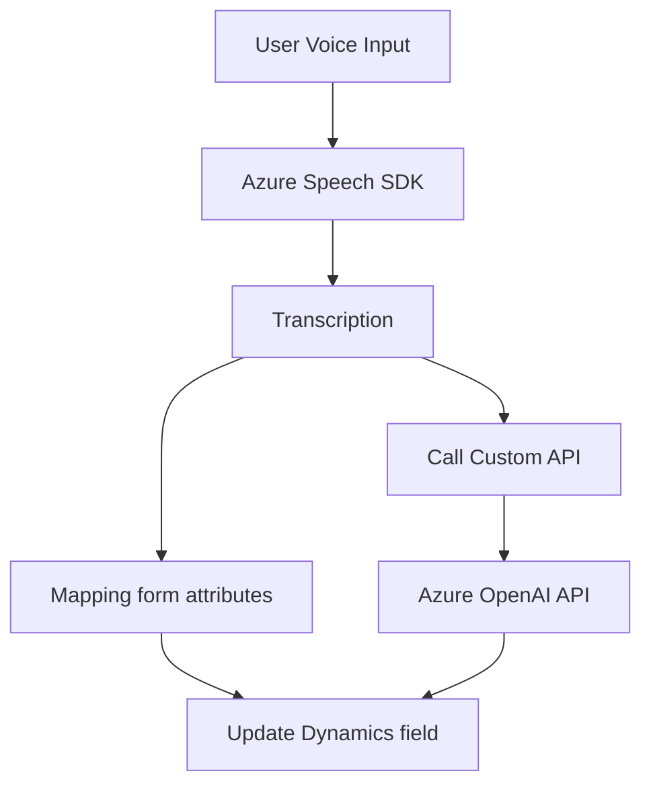

### Breve resumen técnico:
La solución en cuestión incluye varios módulos que trabajan en conjunto para implementar funcionalidades relacionadas con la interacción de voz, análisis de datos y la integración con servicios externos como **Azure Speech SDK** y **Azure OpenAI API**. Probablemente se use en combinación con **Dynamics CRM**, facilitando la automatización de tareas dentro de formularios.

---

### Descripción de arquitectura:
1. **Tipo de solución**:
   - La solución implementa módulos para habilitar una **integración entre aplicaciones frontend (probablemente JavaScript/Dynamics forms)** y servicios de análisis, síntesis y procesamiento automático, como **Azure Speech SDK** para voz y **Azure OpenAI** para procesamiento avanzado.

2. **Tipo de arquitectura**:
   - Este sistema adopta una **n-capas** o **arquitectura modular**:
      - **Frontend funcional** en **JavaScript**: Permite la interacción entre usuarios y formularios de entrada, la gestión del procesamiento de voz y la integración directa con **Azure Speech SDK**.
      - **Plugin backend** en **C#/Dynamics CRM** para la transformación y manejo del contenido textual con reglas predefinidas, utilizando el modelo GPT de Azure como procesamiento centralizado.

3. **Patrones arquitectónicos destacados**:
   - **Patrón Adapter**: Utilizado en funciones como `getReadableValue` o `processTranscript` que transforman datos de formularios o transcripciones en un formato homogéneo para su posterior uso.
   - **Dynamic loading pattern**: Se asegura de cargar **Azure Speech SDK** solo si es necesario mediante la función de `ensureSpeechSDKLoaded`.
   - **Service-oriented integration**: Fuerte interacción y dependencia de servicios externos: **Azure Speech SDK**, **Azure OpenAI API**, y **Dynamics CRM**.
   - **Event-driven programming**: Uso de eventos y promesas para manejar flujos asincrónicos como la carga de SDK y el procesamiento de comandos de voz.
   - **Separation of concerns**: Cada módulo y función está enfocado en una responsabilidad específica (lectura de datos, procesamiento de texto, interacción con APIs, mapeo de campos, etc.).

---

### Tecnologías usadas:
1. **Frontend (JavaScript)**:
   - Framework/Dynamics contexto: Probablemente **Dynamics CRM** (o similar), ya que los archivos mencionan el uso de `Xrm.WebApi` y el manejo de `formContext/executionContext`.
   - **Azure Speech SDK**: Para reconocimiento y síntesis de voz.
   - **ES6+ JavaScript**: Uso de funciones asincrónicas, objetos, y promesas.

2. **Backend (.NET/C#)**:
   - **Plugin**: Implementación basada en **Microsoft Dynamics CRM SDK**.
   - **Azure OpenAI API**: Para el procesamiento de datos textuales.
   - **Tecnologías de .NET**:
      - `HttpClient`: Para solicitudes HTTP REST.
      - `System.Text.Json`: Para la serialización/deserialización de JSON.
      - `Newtonsoft.Json.Linq`: Manejo y procesamiento de objetos JSON.
      - `IPlugin`: Implementación de la interface nativa de Dynamics CRM para plugins.

3. **APIs y servicios consumidos**:
   - **Azure Speech SDK**: Uso en frontend para entrada y salida de voz.
   - **Azure OpenAI API**: Uso en el backend para procesamiento avanzado de texto con modelos AI (GPT-4o).

---

### Diagrama Mermaid válido para GitHub:

---

### Conclusión final:
Este repositorio implementa una solución de integración basada en un **sistema de n capas**, que permite la interacción de usuarios mediante voz con formularios de **Dynamics CRM**. La solución utiliza el **Azure Speech SDK** para reconocimiento y síntesis de voz, y el **Azure OpenAI API** para procesamiento estructurado de datos textuales según reglas predefinidas. A nivel de frontend, destacan patrones como modularidad y loading dinámico, mientras que los plugins backend en **C# Dynamics CRM SDK** reflejan una arquitectura orientada a servicios.

Es una implementación moderna, extensible, y con capacidad de adaptación a nuevos flujos de procesamientos basados en servicios externos.