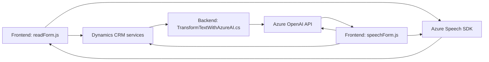

### Breve resumen técnico
El repositorio que has compartido contiene archivos que describen la implementación de funcionalidades basadas en reconocimiento de voz, procesamiento de texto y comunicación con servicios externos como Azure Speech SDK y Azure OpenAI en el contexto de Dynamics CRM (Microsoft Dynamics 365). Estos componentes abarcan aspectos relacionados a interacción con el usuario, manipulación dinámica de datos y extensibilidad del CRM mediante plugins.

---

### Descripción de arquitectura
1. **Tipo de solución**:  
   Principalmente una **aplicación híbrida** que combina:
   - **Frontend modular** para interactuar con el usuario y procesar datos.
   - **Backend orientado a servicios** proporcionado por Dynamics 365 y plugins especializados personalizados (`TransformTextWithAzureAI.cs`).

2. **Arquitectura**:
   - El sistema en su conjunto sigue una arquitectura de **n capas**, donde se pueden identificar claramente:
     - **Capa de presentación (frontend)**: Archivos JavaScript (`readForm.js` y `speechForm.js`) que implementan la lógica para interacción directa con el usuario.
     - **Capa de lógica de negocio**: Plugins de Dynamics CRM (`TransformTextWithAzureAI.cs`) manejan la lógica especializada.
     - **Capa de servicios externos**: Integración con Azure Speech SDK y Azure OpenAI para procesamiento de voz y texto.
   - En parte, el diseño tiene influencias de la **arquitectura orientada a servicios**, dado que uno de sus núcleos es delegar tareas críticas (como síntesis de voz y transformación de texto) a servicios externos.

3. **Patrones utilizados**:
   - **Modularization**: Código organizado en funciones independientes que cumplen responsabilidades específicas y claras.
   - **Carga dinámica** (`Lazy Loading`): Carga dinámica del Azure Speech SDK solo cuando es necesario.
   - **Control de eventos**: Uso de callbacks en los archivos frontend para manejar flujos asincrónicos.
   - **External service facilitator**: El plugin y las funciones frontend delegan procesamiento complejo a servicios externos.

---

### Tecnologías usadas
- **Frontend**:
  - **JavaScript**: Base para la lógica de interacción por voz y procesamiento de datos en la interfaz.
  - **Azure Speech SDK**: Librería para reconocimiento y síntesis de voz.
  - **Dynamics 365 context** (`executionContext`): Gestión y manipulación de datos del formulario.

- **Backend**:
  - **C# (.NET Framework)**: Lenguaje usado para desarrollar el plugin `TransformTextWithAzureAI.cs`.
  - **Dynamics CRM SDK** (`Microsoft.Xrm.Sdk`): Usado para introducir extensiones en Dynamics CRM mediante plugins.
  - **Azure OpenAI**: API del servicio de Azure para procesamiento avanzado de texto.

- **Exteriores**:
  - **Azure Speech SDK**: Procesamiento de voz en tiempo real.
  - **Azure OpenAI**: Procesamiento de texto basado en modelos GPT (como `gpt-4o`).

---

### Diagrama Mermaid

Se utiliza el paradigma de **n capas**, con interacción entre frontend, backend y servicios externos.

---

### Conclusión final
Este repositorio combina una arquitectura de **n capas** con un enfoque hacia **servicios externos especializados**, lo que lo hace una solución moderna y flexible. Los archivos JavaScript se centran en facilitar la interacción del usuario en tiempo real con funcionalidades avanzadas, como el reconocimiento y síntesis de voz, mientras que el código backend delega tareas críticas como la transformación de texto a servicios de Azure. Esta integración aprovecha las capacidades de Dynamics CRM y refuerza la extensibilidad del sistema mediante plugins.

El diseño evidencia prácticas robustas para modularización y delegación de tareas a APIs externas, lo que facilita la mantenibilidad y escalabilidad del sistema.