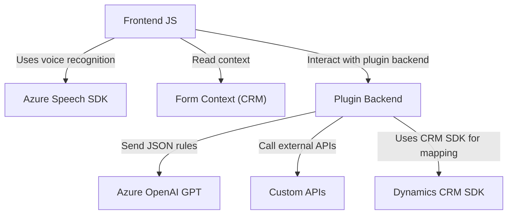

### Breve resumen técnico

El repositorio estructura archivos enfocados a la integración de servicios como el **Azure Speech SDK** (para reconocimiento y síntesis de voz), **Azure OpenAI** (transformación de texto dinámico), y acciones específicas dentro de Dynamics CRM mediante plugins. Este diseño sugiere una solución híbrida cliente-servidor, orientada al entorno de desarrollo de CRM con interacción hacia servicios externos en la nube.

---

### Descripción de arquitectura

La solución presenta una arquitectura **modular integrada en un sistema CRM**, donde diferentes capas y tecnologías se conectan para realizar operaciones específicas:
- **Frontend (JavaScript):** Procesamiento y síntesis de datos del formulario, usando **Azure Speech SDK**.
- **Backend (Plugins):** Transformación de texto y reglas en JSON estructurado con **Azure OpenAI**.
- **Interfaz CRM:** Utiliza el SDK de Dynamics CRM para interactuar con modelos de datos específicos a través de contextos.

La solución aborda dos patrones arquitectónicos principales:
1. **N Capas Modulares:** Separación del frontend y backend de una solución basada en capas bien definidas (cliente, servidor, y componentes externos).
2. **Cliente-Servidor:** Transacciones entre Dynamics CRM (servidor), servicios externos (Azure Speech SDK y OpenAI), con un cliente web para la interacción de los usuarios finales.

---

### Tecnologías usadas

1. **Frontend:**
   - JavaScript (ES6): Organización modular en archivos `.js`.
   - **Azure Speech SDK:** Voz a texto y texto a voz (transcripción y síntesis).
   - HTML Forms (contextos; manejo de formularios CRM visibles).

2. **Backend:**
   - **.NET Framework:** Extensiones mediante plugins y lógica en `C#`.
   - **Dynamics CRM SDK:** Interfaz estándar para consultas y extensiones de CRM.
   - **Azure OpenAI GPT (GPT-4):** Integración con servicios OpenAI en formato JSON.
   - `HttpClient`, `System.Text.Json`, y `Newtonsoft.Json.Linq`.

3. **Externo:**
   - APIs personalizadas para CRM (probablemente REST).
   - Integración directa con servicios Azure, como Speech y OpenAI.

---

### Diagrama Mermaid

---

### Conclusión final

Este repositorio aprovecha tecnologías cloud y frameworks CRM para construir una solución efectiva de automatización. Con una arquitectura modular cliente-servidor integrada con Dynamics CRM, realiza operaciones tanto de reconocimiento y síntesis de voz como transformación de texto en reglas mediante inteligencia artificial. Aunque es robusta, podría beneficiarse de un enfoque DevOps para la gestión segura de datos sensibles (como claves API) y una mayor desacoplamiento de dependencias directas entre componentes.