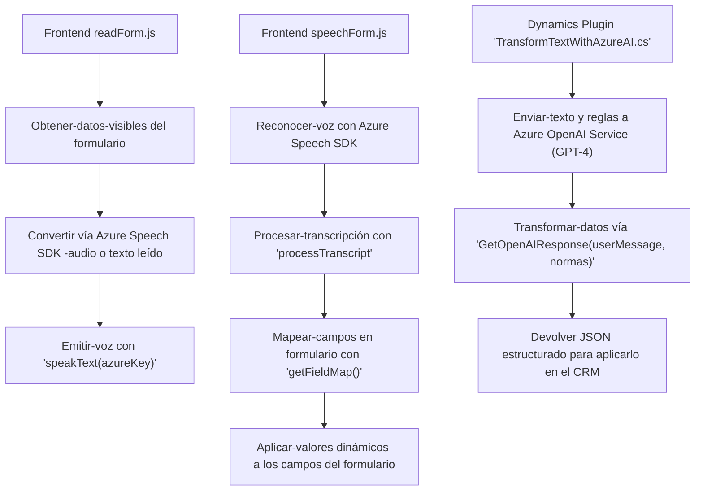

# Análisis completo de repositorio técnico

Este repositorio se centra en la implementación de **funcionalidades relacionadas con reconocimiento de voz, síntesis de audio y transformación de texto** utilizando servicios externos como **Azure Speech SDK** y **Azure OpenAI Service**, integrados dentro de un sistema **CRM Dynamics**. Está diseñado para mejorar la experiencia del usuario mediante la interacción accesible entre formularios CRM y servicios avanzados de IA.

---

## Breve resumen técnico

El código incluye múltiples scripts JavaScript (para la lógica del cliente) y un plugin C# (para procesamiento en Dynamics CRM).  
La solución implementa las siguientes funcionalidades:  
1. **Lectura y síntesis de audio**: Captura datos de formularios visibles para convertirlos en audio usando Azure Speech SDK.  
2. **Reconocimiento de voz**: Convierte comandos de voz en texto y los asigna dinámicamente a campos del formulario de Dynamics CRM usando el modelo de datos del sistema.  
3. **Transformación de texto mediante IA**: Transforma la información textual mediante un plugin que hace uso de Azure OpenAI Service. Este plugin es ejecutado por Dynamics CRM durante un evento o acción configurada.

---

## Descripción de arquitectura

La solución tiene una arquitectura de **n capas**, ya que incluye una separación clara entre diferentes módulos enfocados en:
1. **Capa de front-end (JavaScript)**: Gestión de datos del formulario, lectura, síntesis y mapeo de la información procesada.  
2. **Capa de integración externa**: Uso del Azure Speech SDK para reconocimiento y síntesis de voz, y uso del Azure OpenAI Service para transformación de texto.  
3. **Capa de aplicación intermedia (CRM Business Logic)**: Uso de plugins en Dynamics CRM para extender la funcionalidad con reglas específicas de negocio e integración mediante APIs personalizadas.  

La inclusión de servicios externos introduce aspectos de arquitectura **orientada a servicios (SOA)**, vinculando varios componentes especializados y soluciones tecnológicas.

---

## Tecnologías usadas

### **JavaScript/Frontend**
1. **Vanilla JavaScript:** Uso estándar de JavaScript para manejar lógica en el cliente.
2. **Azure Speech SDK:** Integración con el servicio de síntesis y reconocimiento de voz basado en IA.
3. **CRM Dynamics:** Utilización de objetos como `executionContext` y `formContext` para interactuar con los datos y elementos de formularios en Dynamics CRM.

### **Back-end/Plugins**
1. **C# (ASP.NET Framework):** Implementación del plugin para Microsoft Dynamics CRM con reglas personalizadas.
2. **Azure OpenAI Service (GPT-4)**: Uso para procesamiento y transformación avanzada de texto mediante solicitudes HTTP REST.
3. **Dynamics 365 Web API y plugin:** Gestión de datos dentro del sistema CRM, como mapeo y asignación de valores a campos.

### **Otros**
- **Patrones de diseño**:
  - Modularidad: Funciones organizadas para roles específicos en los archivos de JavaScript/C#.
  - Callback Pattern: Gestión de lógica asincrónica.
  - External Service Integration: Uso de servicios externos como Azure Speech SDK y OpenAI en puntos específicos del flujo.
  
---

## Dependencias o componentes externos

1. **Azure Speech SDK**: Para síntesis y reconocimiento de voz.
   - URL: [https://aka.ms/csspeech/jsbrowserpackageraw](https://aka.ms/csspeech/jsbrowserpackageraw).
   - Utilizado en los archivos `voiceInput.js` y `speechForm.js`.

2. **Azure OpenAI Service**:
   - Utilizado en `TransformTextWithAzureAI.cs` para la transformación de textos mediante un modelo GPT-4.
   - Requiere una API Key y configuración de permisos en Azure.

3. **Microsoft Dynamics CRM**:
   - Interacción con el modelo de datos del sistema.
   - Uso de objetos como `IPlugin`, `executionContext`, y llamadas a APIs RESTful (Web API de Dynamics 365).
   - API personalizada: `trial_TransformTextWithAzureAI`.

4. **Newtonsoft.Json**:
   - Procesamiento de datos JSON (principalmente en el plugin).

---

## Diagrama Mermaid válido para GitHub

---

## Conclusión final

Este repositorio contiene una solución **híbrida y modular** destinada a mejorar la accesibilidad, eficiencia de gestión de datos y capacidades cognitivas en plataformas empresariales como **Microsoft Dynamics CRM**. La arquitectura está diseñada para la integración con servicios externos como **Azure Speech SDK** y **Azure OpenAI**, lo que permite una experiencia avanzada de comunicación basada en voz y procesamiento de contenido.

La combinación entre un sistema **n capas**, **SOA** y patrones de diseño garantiza una mejor estructura y mantenibilidad. Sin embargo, es crucial implementar controles de seguridad adecuados (por ejemplo, hashing o cifrado) para proteger las credenciales de acceso a los servicios externos, especialmente en el caso de la **API Key** de Azure.