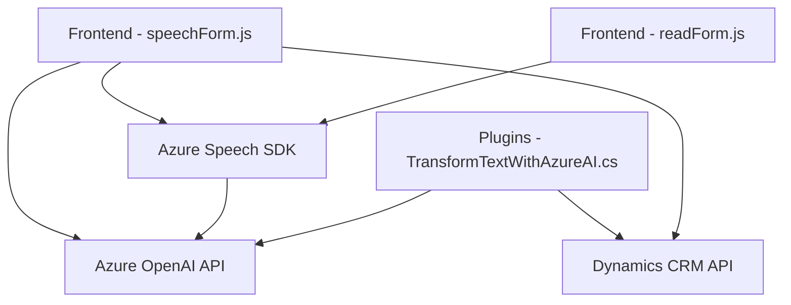

### Breve resumen técnico
La solución es un sistema orientado al reconocimiento de voz, procesamiento de texto y manipulación de datos en formularios de Dynamics CRM. Usa servicios de IA, como Azure Speech SDK y Azure OpenAI API, para implementar una interacción avanzada entre formularios y tecnología de síntesis o procesamiento de voz/texto.

---

### Descripción de la arquitectura
Este sistema utiliza una arquitectura **n capas** con servicios externos:
1. **Capa de presentación**: Implementada con funciones de JavaScript que manejan la interacción de los usuarios con los formularios y servicios externos.
2. **Capa de lógica**: Archivos de plugins que procesan información y gestionan las interacciones con Dynamics CRM y APIs externas.
3. **Capa de datos y servicios externos**: Usa los servicios Azure Speech SDK y Azure OpenAI API para tareas de voz a texto, síntesis de voz y transformación avanzada de texto.

Otras características arquitectónicas:
- **Cliente-Servidor**: Las partes del frontend se comunican con servicios alojados de Azure.
- **Eventos y carga dinámica**: El SDK de Azure Speech se carga solo ante la necesidad, optimizando el uso de recursos.
- **Integración con Dynamics**: El plugin utiliza eventos en Dynamics para procesar información y actualizar datos directamente.

---

### Tecnologías usadas
1. **Frontend:**
   - **JavaScript**: Script para manipulación de formularios y lógica cliente.
   - **Azure Speech SDK**: Reconocimiento y síntesis de voz.
   - **REST APIs**: Comunicación con una API personalizada y Azure servicios (Speech y OpenAI).

2. **Backend:**
   - **C# (Plugin)**: Integración directa con Dynamics CRM mediante eventos.
   - **Azure OpenAI API**: Análisis y transformación de textos usando GPT.

3. **Dependencias importantes:**
   - **Microsoft.Xrm.Sdk**: Framework interno de Dynamics.
   - **Newtonsoft.Json**: Manejo de estructuras JSON.

4. **Patrones:**
   - **Cliente-Servidor con IA**: Interacción entre cliente y procesos alojados en servicios externos.
   - **Por eventos**: Plugins que reaccionan a eventos de Dynamics.

---

### Diagrama Mermaid válido para GitHub

---

### Conclusión final
Bajo una perspectiva técnica, este proyecto es una solución basada en **n arquitectura capas** que integra diferentes tecnologías modernas como **IA (con Azure Speech y OpenAI)**, **manejo de eventos (Dynamics CRM Plugins)** y servicios exógenos para construir funcionalidades avanzadas de entrada/salida de voz y texto. Aunque técnicamente sólido, **aspectos como la gestión de claves y configuración podrían mejorarse** para garantizar su seguridad y portabilidad.