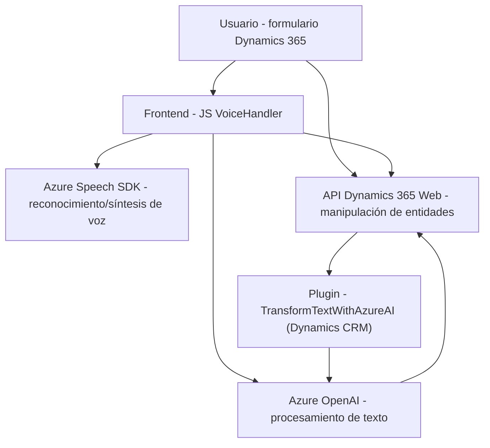

## Breve resumen técnico

El repositorio tiene tres archivos principales: dos relacionados con frontend en JavaScript (para formularios de Dynamics 365 y la integración con Azure Speech SDK) y uno que define un plugin en C# para Dynamics CRM utilizando Azure OpenAI. En conjunto, la solución integra tecnologías de inteligencia artificial y captura de voz mediante servicios de Azure, diseñando una arquitectura que permite el procesamiento de voz y texto de manera dinámica.

---

## Descripción de arquitectura

1. **Tipo de solución:** 
   - La solución combina una API, un plugin para Dynamics CRM en C#, y un frontend interactivo desarrollado en JavaScript. Es una solución híbrida que converge en una aplicación basada en Dynamics 365.

2. **Arquitectura:** 
   - La arquitectura general utiliza una **orientación de servicios** (SOA), donde los componentes están desacoplados y comunicados mediante APIs (REST). Si bien los componentes del frontend se integran con Dynamics CRM, la lógica del sistema se distribuye con un modelo de arquitectura n-capas:
     - **Frontend:** Gestiona la entrada de datos y procesos de voz (JavaScript).
     - **Backend/plugin:** Ejecuta lógica empresarial y manipula la funcionalidad del CRM (Dynamics 365).
     - **Servicios externos:** Comunicación con Azure Speech SDK y el servicio de Azure OpenAI.

3. **Patrones principales usados:**
   - **Modularidad:** Funciones encapsuladas y organizadas para un diseño limpio y reutilizable (JavaScript).
   - **Integración API REST:** Se aprovechan servicios para habilidades de síntesis y análisis de voz/texto (Azure Speech y Azure OpenAI).
   - **Observer Pattern:** Callbacks para manejar eventos del SDK de Azure Speech y captura de interacciones en tiempo real.
   - **Plugin pattern:** Integración con el contexto Dynamics CRM a través de `IPlugin`.

---

## Tecnologías utilizadas

### Frontend:
- **Lenguaje:** JavaScript (ES6).
- **Frameworks/librerías:** Azure Speech SDK, Dynamics 365 Web API.
- **Servicios cloud:** Azure Speech SDK, para reconocimiento y síntesis de voz.

### Backend/Plugin:
- **Lenguaje:** C# (.NET Framework o .NET Core).
- **Framework:** Microsoft Dynamics Plugin Framework.
- **Servicios cloud:** 
  - Azure OpenAI (GPT model) para procesamiento avanzado de texto.
  - API Dynamics 365 para manipulación de registros y atributos.

---

## Dependencias externas o componentes adicionales

1. **Front-end Javascript:**
   - Azure Speech SDK para interacción de voz.
   - Dynamics 365 Web API proporcionada por la biblioteca `Xrm`.

2. **Back-end Plugins:**
   - Servicio Azure OpenAI para transformar texto.
   - `Newtonsoft.Json` (dependencia popular en .NET para manipulación JSON).
   - HTTP libraries (`System.Net.Http`) para enviar solicitudes REST.

---

## Diagrama Mermaid

---

## Conclusión final

La solución está diseñada como un sistema modular e integrador que utiliza servicios de Azure (Speech SDK y OpenAI) junto con Dynamics CRM para crear una experiencia fluida de interacción entre usuarios y sistemas empresariales. Las tecnologías y patrones utilizados aseguran escalabilidad, extensibilidad y un diseño moderno basado en arquitecturas n-capas con capacidades SOA. La implementación es eficiente tanto para el procesamiento de voz como para la interacción basada en datos estructurados.