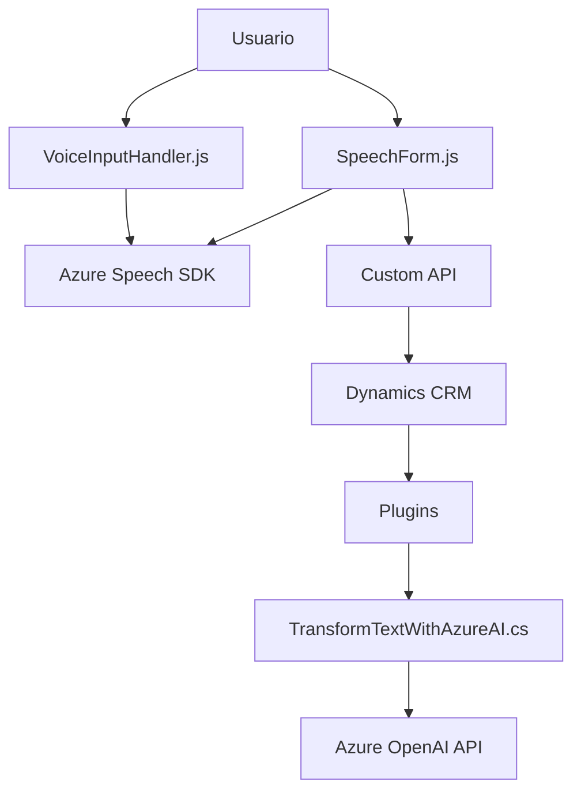

### Breve resumen técnico:
Este repositorio contiene una solución que facilita la interacción por voz en formularios de Dynamics CRM. Aprovecha el reconocimiento de voz, la síntesis de texto y el enriquecimiento de datos mediante servicios de Azure, como Speech SDK y OpenAI API. Está diseñado para mejorar la accesibilidad, automatizar tareas y procesar texto hablado en aplicaciones CRM.

---

### Descripción de arquitectura:
La arquitectura combina las siguientes características:
1. **Capas funcionales independientes**:
   - Capa de presentación: Con archivos Javascript gestionando las funciones de reconocimiento de voz y síntesis de texto adaptadas al entorno de CRM.
   - Capa de negocio: Plugins en el servidor (C#) que interactúan con la lógica del CRM y de la API de Azure OpenAI.
   - Capa de integración con servicios externos (Azure Speech SDK y Azure OpenAI).
   
2. **Patrones empleados**:
   - **Arquitectura n-capas**: Separación por capas que organizan el frontend, la lógica de negocio (Dynamics plugin) y la integración con APIs externas.
   - **Plugin Architecture**: Uso de la interfaz `IPlugin` para integrar comportamiento específico en eventos del CRM.
   - **Data Mapper**: Traducción de los datos del formulario y comandos de voz en un formato estructurado (datos clave-valor).
   - **API Gateway Pattern**: Integración con una Custom API para conectar CRM con el servicio Azure OpenAI y enriquecer los datos procesados.

---

### Tecnologías usadas:
1. **Frontend (HTML y JavaScript)**:
   - **Azure Speech SDK**: Reconocimiento de voz y síntesis de texto.
   - **Asincronismo**: Promises y `async/await` en funciones como `callCustomApi`, `applyValueToField`.

2. **Servidor (C# en Plugins)**:
   - **Microsoft Dynamics CRM SDK (Xrm)**: Manipula datos de formularios CRM.
   - **Azure OpenAI API**: Realiza transformación avanzada de texto en el plugin.
   - **Newtonsoft.Json**: Procesa objetos JSON.

3. **Patrones**:
   - Modularización.
   - API Gateway para integrar servicios externos.
   - Uso de estructuras mapeadas entre visibilidad del CRM y claves internas.

---

### Dependencias o componentes externos:
1. **Azure Speech SDK**: Servicio de Microsoft para reconocimiento y síntesis de voz.
2. **Azure OpenAI API**: Procesamiento avanzado de texto con GPT.
3. **Custom API**: Llamadas remotas desde el cliente a una API personalizada (`trial_TransformTextWithAzureAI`).
4. **Microsoft Dynamics SDK**: Permite la interacción con formularios y campos del CRM.
5. **Newtonsoft.Json**: Procesamiento de JSON.

---

### Diagrama **Mermaid**:

---

### Conclusión final:
Este repositorio refleja una solución para la entrada de datos por voz en formularios de Dynamics CRM, con integración de servicios de Azure. La arquitectura utiliza patrones comunes en sistemas corporativos avanzados, como n-capas, integración con servicios externos (SDK/API) y plugins CRM. Además, su enfoque en la accesibilidad y la automatización lo convierte en una solución eficiente y moderna. Sin embargo, exige una configuración previa con claves de API y dependencias externas como Azure Speech SDK y OpenAI API para su óptimo funcionamiento.