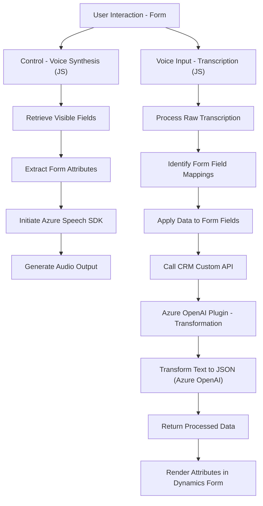

### Resumen Técnico

El repositorio describe una solución integrada que utiliza Microsoft Dynamics CRM y Azure Speech SDK para ofrecer capacidades de interacción por voz, que incluye síntesis y reconocimiento de voz. Además, implementa un plugin para transformar texto desde Dynamics CRM usando la API de Azure OpenAI.

---

### Descripción de Arquitectura

1. **Tipo de Solución:**
   - Solución compuesta con enfoque en la interacción por voz y procesamiento de datos mediante APIs externas. Está diseñada para extender las capacidades de Microsoft Dynamics CRM.
   - Combinación de elementos frontend (JS) y backend (.NET plugin).

2. **Arquitectura:**
   - **Microservicios:** Integración directa con servicios externos (Azure Speech SDK y Azure OpenAI) para delegar ciertas tareas.
   - **Modularidad:** Diseño desacoplado entre las capas frontend (scripts para interacción dinámica con el usuario), conexión con APIs externas, y lógica backend (transformación de datos).
   - **Event-Driven Architecture:** Uso de eventos asincrónicos y callbacks para manejar flujos basados en la carga dinámica de SDKs y respuestas API.

---

### Tecnologías, Frameworks y Patrones

1. **Frontend (JavaScript):**
   - **Azure Speech SDK:** Para reconocimiento y síntesis de voz.
   - **Patrón basado en eventos:** Flujos de interacción se activan dependiendo del estado de los recursos (ej. SDK cargado).
   - **Dynamic Script Loading:** Carga scripts como el SDK dinámicamente para maximizar la eficiencia.

2. **Backend (.NET):**
   - **Microsoft Dynamics CRM SDK:** Para automatización de flujos en formularios y entidades CRM.
   - **Azure OpenAI Integration:** Delegación de procesamiento semántico y transformación de texto a API externa.
   - **Plugin Framework:** Encapsulación lógica siguiendo la interfaz `IPlugin`.

---

### Dependencias o Componentes Externos

1. **Componentes externos:**
   - Azure Speech SDK: Para lectura y grabación de voz utilizando inteligencia artificial.
   - Azure OpenAI API: Transformación de texto mediante reglas definidas en formato JSON.
   - API personalizada de Dynamics CRM: Procesamiento y transformación texto con IA.
   - Microsoft Dynamics CRM Form Context: Manejo de datos y atributos en formularios de CRM.

2. **Componentes internos:**
   - Funciones para procesamiento de transcripción y mapeo de campos en formularios.
   - Plugin Dynamics CRM que utiliza el servicio de Azure para procesamiento externo.

---

### Diagrama Mermaid

---

### Conclusión Final

El repositorio implementa una solución específica de interacción por voz y procesamiento semántico integrada en el ecosistema de Microsoft Dynamics CRM. Este diseño demuestra una arquitectura basada en microservicios y modularidad, utilizando servicios externos como Azure para proporcionar inteligencia artificial avanzada, minimizando la carga computacional local. Ideal para escenarios que combinen IA en tiempo real con automatización empresarial.