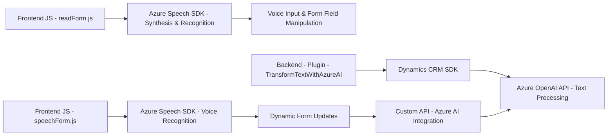

### Breve resumen técnico:

El repositorio corresponde a una solución que combina **frontend interactivo**, utilización de APIs externas (Azure Speech SDK y Azure OpenAI), y lógica de negocio personalizada en un **backend/plugin para Dynamics 365**. Los archivos sugieren una integración de reconocimiento de voz, síntesis de texto a voz, manipulación de formularios, y transformación de texto mediante IA, todo orientado a aplicaciones empresariales como CRM (Customer Relationship Management).

### Descripción de arquitectura:

1. **Tipo de solución**:
   - La solución presenta componentes de **frontend** interactivo en JavaScript (manipulación de formularios basada en voz) y un **backend/plugin** para Dynamics 365 (integración IA).
   - Incluye una fuerte integración con servicios externos, incluyendo **Azure Speech SDK** para síntesis y reconocimiento de voz y **Azure OpenAI** para transformación de texto.

2. **Arquitectura**:
   - **N-capas**: Se observa separación explícita entre:
     - **Presentación** (manipulación de formularios mediante frontend interactivo).
     - **Lógica de negocio personalizada** (plugin Dynamics 365).
     - **Capas externas** para IA y voz, utilizando Azure Speech SDK y Azure OpenAI API.
   - **Event-Driven Architecture**: Reconocimiento de voz y síntesis están impulsados por eventos de interacción del usuario en tiempo real.
   - **Modularización**: Se evidencia en la separación de funciones y clases con responsabilidades específicas.

3. **Patrones de diseño**:
   - **Lazy Loading**: Carga dinámica del Azure Speech SDK solo cuando es necesario.
   - **Facade**: Simplifica la interacción con APIs de Azure mediante funciones encapsuladas.
   - **Singleton/Resource Isolation**: Uso controlado de `HttpClient` para evitar problemas de gestión de recursos en el backend.

### Tecnologías usadas:

- **Frontend:**
  - **JavaScript** para manipulación del DOM y lógica interactiva.
  - **Azure Speech SDK**: Reconocimiento y síntesis de voz.
  - **Browser APIs**: Manipulación de eventos y formularios.

- **Backend/Plugin:**
  - **C#/.NET**: Implementación de plugins en Dynamics 365.
  - **Dynamics CRM SDK** (`IPlugin`, `IServiceProvider`): Extensiones para lógica de negocio.
  - **Azure OpenAI API**: Procesamiento de texto con inteligencia artificial.
  - **Newtonsoft.Json** y **System.Text.Json**: Manejo de datos JSON.

### Diagrama **Mermaid** compatible con **GitHub Markdown**:

### Conclusión final:

La solución presenta una integración avanzada entre reconocimiento de voz, manipulación de formularios en tiempo real, y procesamiento de texto con IA, adecuándose a sistemas empresariales como CRM. La arquitectura modular y distribuida refleja un diseño basado en **N-capas**, con una fuerte dependencia de APIs externas como Azure Speech SDK y Azure OpenAI. Esto la hace idónea para aplicaciones enfocadas en accesibilidad, interacción natural y automatización mediante IA.