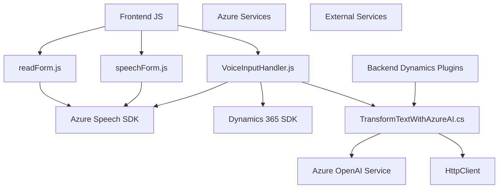

### Breve resumen técnico:
El repositorio contiene tres archivos que forman parte de una solución enfocada en la integración de tecnología de voz y procesamiento de texto con Microsoft Dynamics CRM y servicios de Microsoft Azure. Es un conjunto ligado a una API y funcionalidades backend enfocadas en reconocimiento y síntesis de voz, así como el procesamiento de entrada de comandos de voz.

### Descripción de arquitectura:
La solución está compuesta por un modelo híbrido que combina una arquitectura de **n capas** y **microservicios**:
1. **Frontend**: Archivos JavaScript que manejan la interacción del usuario, como reconocimiento de voz y síntesis de texto en voz.
2. **Backend**: Plugin backend para Dynamics CRM que delega procesamiento avanzado a un servicio de microservicios externo, en este caso, **Azure OpenAI**.

La arquitectura utiliza:
- Separación de preocupaciones entre experiencia de usuario (Frontend/JS) y lógica empresarial (Plugins/TransformTextWithAzureAI).
- Servicios externos (SDK de Azure Speech y Azure OpenAI) con enfoque en microservicios para procesamiento específico.

### Tecnologías usadas:
1. **Lado cliente**:
   - **JavaScript** (EF6+): Manipulación de DOM, integración con SDK de Azure Speech, procesamiento de datos dinámicos de formularios.
   - **Azure Speech SDK**: Reconocimiento y síntesis de voz.
   - **Dynamics 365 SDK Xrm.WebApi**.
   
2. **Lado servidor**:
   - **C#/.NET Framework**: Desarrollo del plugin.
   - **Microsoft Dynamics SDK**: Contexto del CRM y ejecución de Custom APIs.
   - **Azure OpenAI Service**: Procesamiento inteligente de texto y respuesta en JSON.
   - **Newtonsoft.Json**: Facilitación de operaciones JSON y respuestas API.

3. **APIs**:
   - **Custom APIs en Dynamics**: Extensión lógica para Dynamics CRM.
   - **Azure OpenAI & Speech APIs**: Microservicios especializados para texto-a-voz y voz-a-acción.

### Dependencias y componentes externos:
1. **Azure Speech SDK**.
2. **Azure OpenAI Service** (modelo GPT-4).
3. **Dynamics 365 SDK (`Xrm.WebApi`)** para interacción con datos del CRM.
4. **HttpClient** para solicitudes HTTP hacia Azure OpenAI.
5. **Internamente**:
   - Arquitectura de formularios dinámicos de Dynamics CRM.
   - Valores codificados como claves de acceso API en los archivos.

### Diagrama **Mermaid** (100% compatible con GitHub Markdown):

### Conclusión final:
La solución demostrada en el repositorio refleja una integración avanzada y modular con Microsoft Dynamics CRM mediante extensiones personalizadas (plugins y JavaScript) y servicios inteligentes externos proporcionados por Azure. La arquitectura utiliza un modelo donde partes del procesamiento pesado, como reconocimiento de voz y texto inteligente, se externalizan eficientemente en microservicios. La separación de funcionalidad entre frontend y backend, y el uso de SDK y patrones como callbacks y DTOs, hacen que la solución sea mantenible, extensible, y adecuada para entornos CRM corporativos. Sin embargo, el manejo de claves y valores sensibles podría beneficiarse de mejores prácticas en términos de seguridad, como la incorporación de secretos a través de configuraciones protegidas.