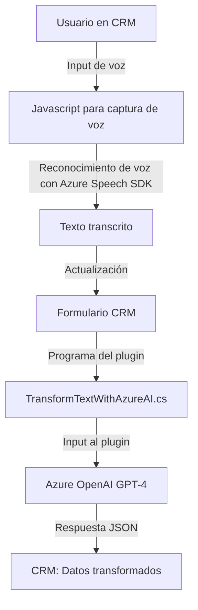

### Resumen técnico
El repositorio se compone de tres archivos fundamentales que colaboran para ofrecer una solución robusta de integración entre formularios dinámicos, procesamiento de datos por voz y servicios de IA en Microsoft Dynamics CRM, utilizando Azure Speech SDK y Azure OpenAI GPT-4.

---

### Descripción de arquitectura
La solución implementada utiliza una arquitectura **modular en capas** donde:
1. El **frontend** procesa datos locales y los transforma (manipulación de formularios, reconocimiento y síntesis de voz con Azure Speech SDK).
2. Un **plugin backend puede transformar texto utilizando Azure OpenAI GPT-4** mediante un evento conectado al sistema CRM.
3. La solución presenta una integración entre componentes internos del CRM (por ejemplo, los formularios `formContext`) y APIs externas (Azure Speech SDK y OpenAI API).

#### Principales patrones:
- **Modularización:** Funciones separadas por responsabilidades específicas.
- **Integración externa:** Conexión con APIs como Azure Speech y Azure OpenAI.
- **Carga dinámica de dependencias:** Lazy load (carga bajo demanda) de Azure Speech SDK en el frontend.
- **Adaptadores:** Transcripción de datos de texto en estructuras JSON estandarizadas.
- **Formato basado en eventos:** El plugin se ejecuta en función de interacciones con Dynamics CRM.

---

### Tecnologías utilizadas
1. **Frontend:** JavaScript con Azure Speech SDK para interacción por voz.
2. **Backend:** .NET Framework, integrando Dynamics CRM SDK y el plugin `TransformTextWithAzureAI.cs`.
3. **Servicios externos:** Azure Speech Services y Azure OpenAI GPT-4.
4. **Infraestructura:** Microsoft Dynamics CRM para eventos y contexto de ejecución.

---

### Diagrama **Mermaid**

---

### Conclusión final
Este repositorio entrega una solución **integrada por capas** que combina el reconocimiento y síntesis de voz usando Azure Speech SDK con la transformación inteligente de datos mediante Azure OpenAI GPT-4. La arquitectura está orientada al procesamiento asincrónico y modular, integrando un sistema CRM con APIs externas de manera eficiente. La carga dinámica de dependencias y los adaptadores utilizados aseguran que la solución sea escalable y fácil de extender para futuras funcionalidades.