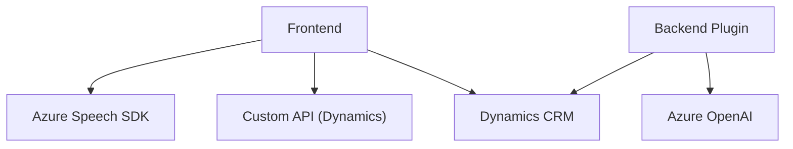

### Breve resumen técnico

El repositorio contiene varios archivos, principalmente orientados a interactuar con formularios mediante voz, procesar entradas mediante IA (OpenAI y Azure Cognitive Services), y manipular datos en un entorno de Dynamics CRM. La solución integra frontend (JavaScript) y componentes backend como un plugin en C#. Es una solución híbrida que centraliza su lógica en servicios externos (Azure y Dynamics) mientras opera sobre módulos bien separados según funcionalidades específicas.

---

### Descripción de arquitectura

La arquitectura es predominantemente **n capas**, con integración de servicios externos. Puede desglosarse en:
1. **Frontend:** Incluye scripts para capturar input de voz, interactuar y sintetizar información del usuario mediante formularios en un entorno web, utilizando Dynamics CRM como contexto.
2. **Backend:** Implementa un plugin para transformar textos con Azure OpenAI que interactúa con Dynamics CRM. Este plugin sigue un patrón de **extensibilidad** típico en Dynamics.
3. **Servicios Externos:** Usa APIs de Azure (OpenAI y Speech SDK) para tareas de reconocimiento de voz, síntesis y procesamiento de entradas de texto. También se conecta a Custom APIs de Dynamics CRM.

---

### Tecnologías usadas

1. **Frontend:**
   - **JavaScript (Vanilla):** Usado para lógica del navegador.
   - **Azure Cognitive Services Speech SDK:** Para reconocimiento y síntesis de voz.
2. **Backend:**
   - **C# (.NET Framework):** Para plugins de Dynamics CRM.
   - **ASP.NET y Dynamics SDK:** Manejo de eventos en Dynamics y manipulación de entidades.
3. **Servicios externos:**
   - **Azure OpenAI (GPT):** Procesa y transforma texto según reglas predefinidas.
   - **Azure Speech SDK:** Procesa voz en el frontend.
4. **Dependencias:** 
   - **Newtonsoft.Json:** Manejo de JSON para solicitudes y respuestas.
   - **System.Net.Http.HttpClient:** Para consumo de APIs externas.
   - **Xrm.WebApi:** Llama a APIs de Dynamics desde el frontend.

---

### Diagrama Mermaid válido para GitHub

---

### Conclusión final

La solución integra múltiples servicios y tecnologías, posicionándose como una herramienta innovadora para formularios dinámicos en entornos CRM. La arquitectura sigue patrones "extensibles" dentro de Dynamics y reutiliza servicios externos (Azure Speech, OpenAI). Su capa de frontend ofrece interactividad auditiva mediante voz, mientras que el backend delega la lógica avanzada de transformación textual a APIs externas, garantizando un flujo moderno y desacoplado.

La división de responsabilidades y su orientación hacia servicios como Azure y Dynamics refuerzan su modularidad y capacidad de escalabilidad.