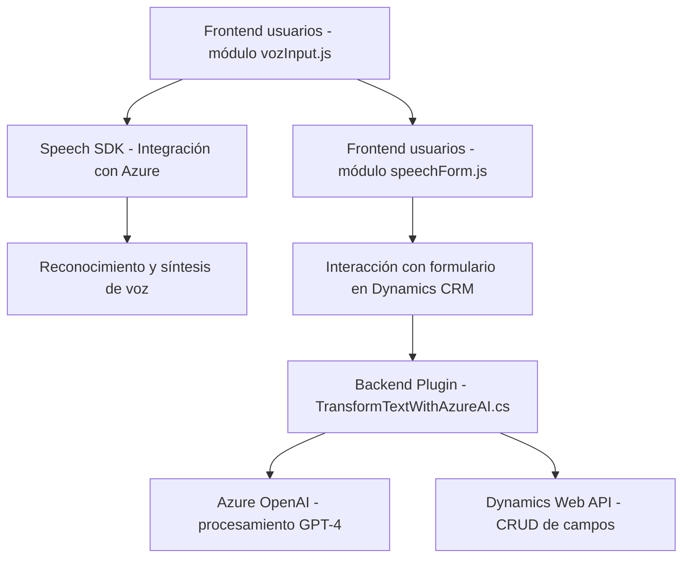

### Breve resumen técnico:

El repositorio contiene tres archivos principales que representan dos elementos de frontend (manejo de formularios y reconocimiento de voz) y un archivo backend (plugin para Dynamics CRM). La solución parece enfocada en extender las capacidades de Dynamics 365 mediante integración con servicios cloud (Azure Speech SDK y Azure OpenAI) para incorporar features como reconocimiento de voz y procesamiento avanzado de texto.

---

### Descripción de arquitectura:

1. **Tipo de Solución:**
   - Es una **sistema híbrido** que incluye:
     - Parte **frontend** basada en interacciones con formularios de Dynamics 365.
     - Parte **backend** con un plugin para extender la funcionalidad del CRM.
     - Integración estrecha con servicios externos de Azure (Speech SDK y OpenAI).

2. **Arquitectura General:**
   - **Capa de presentación (frontend):** Se organiza en un modelo no convencional (modular) con funciones claras para la interacción con el usuario mediante formularios y reconocimiento/síntesis de voz.
   - **Capa de negocio (backend):** Plugin para Dynamics 365 que actúa como intermediario entre el frontend y los servicios de Azure para transformar texto en estructuras JSON, con lógica específica.
   - **Integración en n-capas:** El sistema organiza sus funcionalidades separando claramente la presentación, lógica/dominio y la interacción con servicios externos, aunque no utiliza patrones avanzados como DDD (Hexagonal o Microservicios).

3. **Tecnologías y Patrones:**
   - Tecnologías:
     - **Azure Speech SDK:** Reconocimiento y síntesis de voz.
     - **Azure OpenAI (GPT-4):** Procesamiento avanzado de texto.
     - **Dynamics 365 Web API:** CRUD API/Modelo extensible del CRM.
     - **JavaScript (ES6):** Para manipulación de formularios y UI.
     - **C# (.NET):** Para definición del plugin y negocio backend.
   - Patrones usados:
     - Modularización: Encapsulación de funciones en clases y módulos claros.
     - Arquitectura extensible: Uso del patrón de Plugins en Dynamics CRM.
     - Builder Pattern: Construcción de requests JSON para APIs externas.
     - Delegación a SDK externos: Uso de APIs de Azure con interacción directa (HTTP).

4. **Dependencias o componentes externos presentes:**
   - Dependencias clave:
     - Azure Speech SDK: Carga dinámica desde CDN para funcionalidades de síntesis/reconocimiento.
     - Azure OpenAI (GPT-4): Endpoint para procesamiento de datos.
     - Dynamics 365 Web API: CRUD de campos de formularios y búsqueda en entidades.
   - Librerías integradas:
     - `Newtonsoft.Json.Linq` y `System.Text.Json` en backend (manipulación JSON).
     - `System.Net.Http`: Llamadas REST al endpoint de OpenAI.
     - `Microsoft.Xrm.Sdk`: Paquete estándar de Dynamics para extensiones.

---

### **Diagrama Mermaid válido para GitHub:**

---

### **Conclusión final:**

La solución representa un sistema híbrido que utiliza un modelo **n-capas**. La capa de presentación trabaja sobre formulación de datos de usuarios, con integración de reconocimiento y síntesis de voz mediante **Azure Speech SDK**. La capa de negocio está dedicada al procesamiento de texto con **Azure OpenAI** mediante un plugin de Dynamics CRM. Aunque los componentes son bien organizados y funcionales, hay áreas de oportunidad: la seguridad en el manejo de claves (en el frontend), seguimiento estricto de patrones avanzados como DDD y una mejor separación de responsabilidades.

La solución tiene un enfoque claro y está bien diseñada para escenarios de procesamiento avanzado de voz y texto, destacando la inclusión de tecnologías Azure como un punto clave en la funcionalidad del sistema.