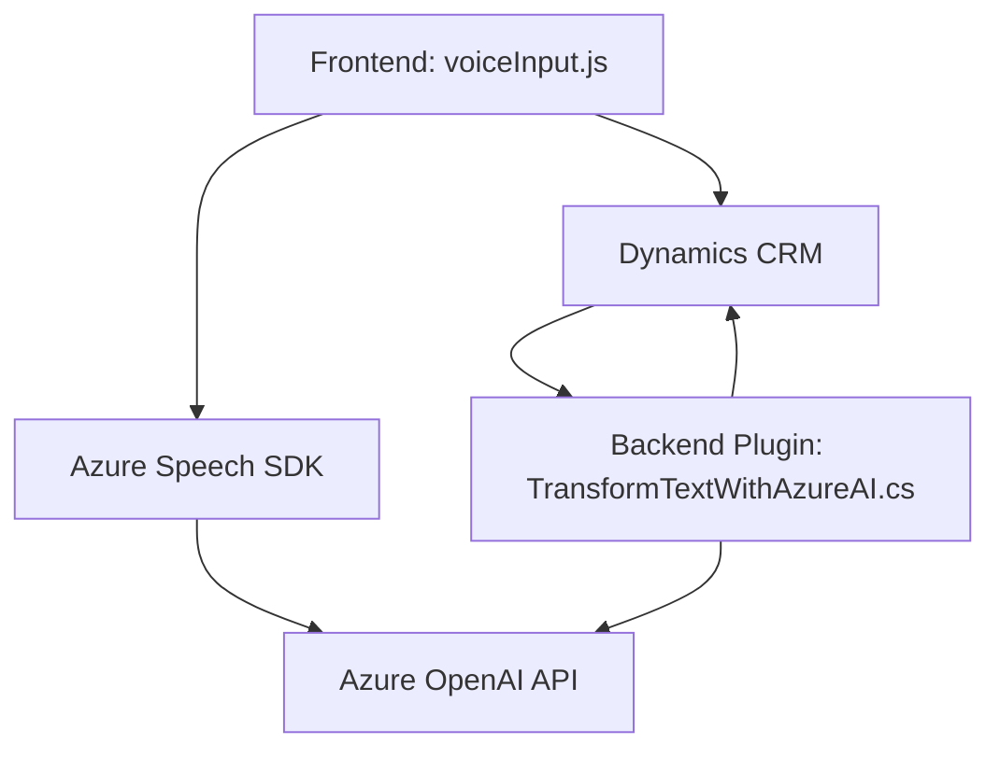

### Breve resumen técnico:

El repositorio describe una solución compuesta por archivos para un **frontend** que utiliza entradas de voz y procesamiento de formularios (JavaScript) y un **backend plugin** desarrollado en C# para integrar Microsoft Dynamics CRM con servicios de Azure OpenAI para transformación de texto. También se integran servicios API externos, como Azure Speech SDK y Azure OpenAI.

---

### Descripción de arquitectura:
- **Frontend:** 
  Utiliza una arquitectura modular basada en funciones JavaScript. Está orientado a manipular datos de formularios mediante síntesis y reconocimiento de voz proporcionado por Azure Speech SDK. Utiliza patrones como mapeo de campos (`getFieldMap`) y encapsulación para interactuar con servicios externos, como una API del CRM.

- **Backend:** 
  Implementa un **plugin de Dynamics CRM**, acoplado al sistema mediante la interfaz `IPlugin`. Permite ejecutar lógica de negocio personalizada relacionada con la transformación de texto en objetos JSON estructurados, integrándose con Azure OpenAI.

### Arquitectura general:
La solución refleja una **estructura de integración vertical**:
- Frontend pensada para captar e interpretar datos en tiempo real.
- Backend procesando datos estructurados con patrones externos (API).

En términos de diseño:
- **Frontend:** Divide las funcionalidades en capas n-lógicas (captura, procesamiento, interacción API).
- **Backend Plugin:** Sigue el diseño de **arquitectura de Plugins** y depende explícitamente de eventos del CRM y servicios externos.

---

### Tecnologías usadas:
1. **Frontend:**
   - **JavaScript**: Lógica principal para captura de datos, streaming y procesamiento de voz.
   - **Azure Speech SDK**: Para manejo de síntesis y reconocimiento de voz.
   - **API personalizada en Dynamics CRM**: Interacción con el backend del CRM.

2. **Backend:**
   - **C#**: Lenguaje para el plugin.
   - **Microsoft Dynamics CRM SDK**: Para servicios organizacionales, manipulación de contexto, y ejecución de lógica de negocio.
   - **Azure OpenAI**: Para procesamiento de texto mediante inteligencia artificial.
   - **HttpClient / JSON Libraries**: Para consumo de APIs externas y manipulación de respuestas JSON.

---

### Diagrama **Mermaid** válido para GitHub:

---

### Conclusión final:

La solución proporcionada representa una **hybrid architecture** que integra componentes frontend (con Azure services) y backend (plugin CRM). Las tecnologías de Azure son clave en el procesamiento de voz y generación de texto estructurado, conectados mediante APIs externas. El frontend facilita interacción con interfaces en tiempo real, mientras que el backend transforma textualmente entradas de usuario en estructuras útiles dentro del ecosystem CRM.