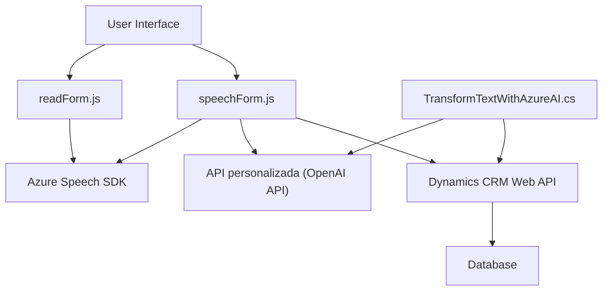

### Resumen técnico:

El repositorio contiene tres componentes principales: dos archivos de JavaScript destinados al frontend dentro de Dynamics CRM, y un archivo C# que implementa un plugin en el backend del mismo ecosistema. En conjunto, la solución está diseñada para proporcionar funcionalidades de conversión de texto a voz y reconocimiento de voz, junto con la transformación de datos mediante Azure OpenAI en un entorno cerrado basado en Dynamics CRM.

---

### Descripción de arquitectura

La arquitectura propuesta es un modelo de **n capas** diseñado específicamente para trabajar dentro del ecosistema Dynamics CRM. Las capas principales incluyen:

1. **Frontend (Interfaz de usuario)**:
   - Los archivos de JavaScript (`readForm.js` y `speechForm.js`) gestionan la interacción directa con el usuario y los datos del formulario, además de realizar tareas relacionadas con la síntesis y reconocimiento de voz utilizando el Azure Speech SDK y APIs externas.

2. **Business Logic Layer**:
   - La lógica de negocio se gestiona principalmente dentro del archivo C# (`TransformTextWithAzureAI.cs`), que interactúa con Azure OpenAI y realiza transformaciones avanzadas del texto.

3. **Integración con Servicios Externos**:
   - Azure Speech SDK (para voz y reconocimiento).
   - Azure OpenAI API (para procesamiento avanzado de texto).

4. **Data Layer**:
   - Este se implementa mediante la API de Dynamics CRM (`Xrm.WebApi`), gestionando la interacción con las entidades del CRM y asignando datos procesados a los campos correspondientes.

---

### Tecnologías usadas

1. **Frontend**:
   - **JavaScript** como lenguaje principal.
   - **Azure Speech SDK** para síntesis y reconocimiento de voz.
   - **Dynamics CRM Web API** (`Xrm.WebApi`) para modificación y extracción de datos del sistema.

2. **Backend**:
   - **C#** como lenguaje de implementación.
   - **Microsoft.Xrm.Sdk** para la integración del plugin con Dynamics CRM.
   - **Azure OpenAI API** usada mediante solicitudes HTTP.
   - Serialización de datos con **System.Text.Json** y probablemente **Newtonsoft.Json**.

3. **Servicios de nube**:
   - **Microsoft Azure**.

---

### Diagrama **Mermaid** 100% compatible con **GitHub Markdown**

Explanation of the diagram:
- The **User Interface** (`A`) interacts with two frontend scripts (`B` and `C`), which handle tasks such as gathering form data and converting user speech into actionable text.
- Both JavaScript files depend on **Azure Speech SDK** (`D`) for synthesis and recognition of voice.
- The `speechForm.js` additionally calls a **custom API** (`E`) to integrate with **OpenAI** via HTTP for AI-driven data transformation.
- The **TransformTextWithAzureAI.cs** file (`F`) handles backend data transformations via this same API (`E`) and interacts with **Dynamics CRM Web API** (`G`) for updating the backend data layer which maps to a **Database** (`H`).

---

### Conclusión final

La solución completa representa una implementación robusta diseñada para Dynamics CRM, utilizando una arquitectura clásica de **n capas** con integración avanzada con servicios en la nube como Azure Speech SDK y Azure OpenAI API. Sus componentes están bien organizados y aplican mejores prácticas como la carga dinámica de SDKs y modularidad funcional. Además, el uso de APIs externas y plugins personalizables garantiza un alto grado de extensibilidad, adaptándose eficientemente a casos de uso avanzados en CRM.