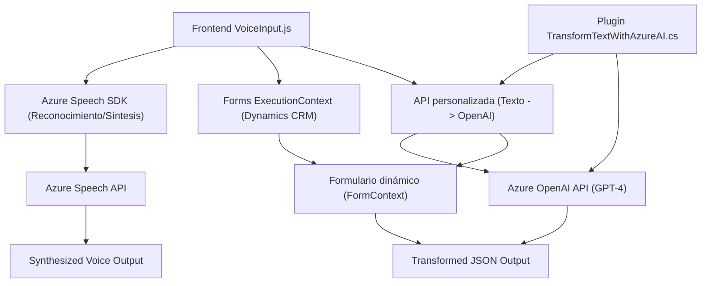

# Análisis técnico y conclusión

### Breve resumen técnico
El repositorio combina múltiples componentes que integran **sintetización de voz**, **reconocimiento de voz** y **transformación inteligente de texto** en soluciones CRM, utilizando herramientas de Microsoft Dynamics CRM y servicios de Azure (Speech SDK y GPT-4 via Azure OpenAI). Este enfoque facilita la interacción entre usuarios y sistemas mediante voz y texto, generando experiencias más intuitivas.

### Descripción de arquitectura
La solución tiene una **arquitectura basada en capas**, donde cada componente (frontend, backend, y servicios externos de Azure) está bien delimitado. Los archivos de JavaScript representan una capa de presentación (frontend) orientada a operaciones de voz y manipulación de datos dinámicos en formularios. El archivo `.cs` funciona como un plugin especializado que actúa como intermediario para llevar datos hacia Azure OpenAI para procesamiento avanzado. Aunque no es una arquitectura estrictamente hexagonal ni de microservicios, existen principios de modularidad claros y una integración con servicios externos.

### Tecnologías usadas
1. **Frontend JavaScript**:
   - SDK de Azure Speech para síntesis y reconocimiento de voz.
   - Manejo dinámico de formularios con JavaScript en el contexto de Dynamics CRM (`executionContext` y `formContext`).
   - Lógica de lazy-loading para cargar dependencias solo cuando son necesarias.

2. **Backend .NET**:
   - Microsoft Dynamics CRM SDK: Extensión funcional mediante plugins.
   - Framework .NET para manipulación de cadenas, operaciones HTTP y serialización.
   - Azure OpenAI API para interpretación avanzada de texto usando GPT.

3. **Servicios externos**:
   - Azure Speech SDK: Reconocimiento y síntesis de voz.
   - Azure OpenAI con GPT-4: Análisis y estructuración de datos.

### Dependencias o componentes externos
- **Azure Speech SDK**: Para reconocimiento y síntesis de voz.
- **Azure OpenAI API (GPT-4)**: Para transformación avanzada de texto.
- **Microsoft Dynamics CRM SDK**: Como contexto y base de ejecución en el plugin.
- **HttpClient (.NET)** para manejar peticiones HTTP REST a APIs externas.

### Diagrama Mermaid

### Conclusión final
Este repositorio presenta una solución **orientada a voz y texto** integrada en entornos CRM, lo que facilita interacciones humanas a través de tecnologías avanzadas como el reconocimiento y la síntesis de voz del Azure Speech SDK, complementadas con transformaciones utilizando GPT-4. Aunque la arquitectura no es estrictamente modular como microservicios, sí emplea principios de separación de capas. La alineación entre el frontend y el backend es clara y utiliza dependencias externas únicamente cuando son necesarias (lazy-loading y API calls). Es ideal para integrar inteligencia artificial y manejo de voz en sistemas empresariales como Dynamics CRM.