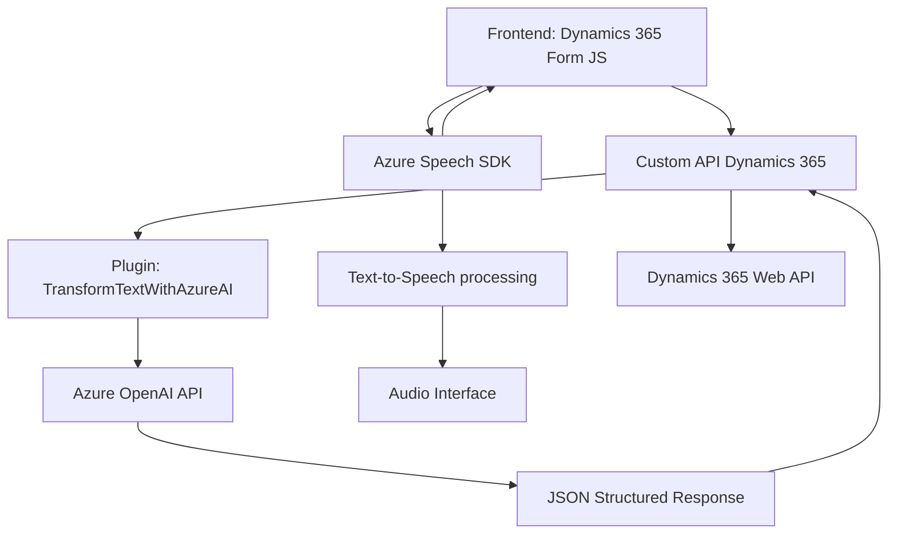

### Breve resumen técnico:
El repositorio presenta una solución orientada a **certificación e integración de datos mediante voz** y procesamiento de texto en entornos Microsoft Dynamics 365 y servicios de Microsoft Azure. La lógica cubre tres áreas clave:
1. El frontend utiliza **JavaScript** para manejar reconocimiento y síntesis de voz (Azure Speech SDK).
2. Se integran servicios personalizados para trabajar con **Dynamics 365 Web API**.
3. Un plugin en **C#** interactúa con **Azure OpenAI** para transformar texto siguiendo reglas estructuradas.

---

### Descripción de arquitectura:
La solución sigue una **arquitectura de capas** donde:
- El frontend actúa como capa de presentación y procesamiento inicial.
- Los plugins en C# de Dynamics CRM representan una lógica empresarial e integración de microservicios de inteligencia artificial (Azure OpenAI).
- Dependencias externas (Azure Speech SDK y OpenAI) sirven como proveedores de procesamiento especializado en nube.

En cierto grado, se inclina hacia una arquitectura distribuida mediante dependencias externas (Azure Speech y Dynamics APIs) y proveedores de servicios como OpenAI.

---

### Tecnologías usadas:
1. **Frontend**:
   - **JavaScript**: Base del manejo de eventos y APIs.
   - **Azure Speech SDK**: Para reconocimiento y síntesis de voz integrado.
   - **Dynamics 365 Web API**: Para trabajar con los datos dinámicos en formularios.

2. **Backend**:
   - **C# (Microsoft .NET)**: Base para plugins de CRM y lógica del modelo de negocio.
   - **Azure OpenAI API**: Procesamiento avanzado de texto estructurado.
   - **Newtonsoft.Json** y **System.Json**: Para abordar serialización/deserialización JSON.

3. **Arquitectura distribuida**:
   - Microservicios basados en API (Azure Speech SDK y Azure OpenAI).

4. **Patrones**:
   - **Event-driven design**: Captura y manejo de eventos (ej. síntesis de voz).
   - **Plugin Pattern**: Prefijo estructurado para Dynamics CRM.
   - **Modular y desacoplado**: Utilización de dependencias mediante servicios externos.

---

### Diagrama Mermaid:

---

### Conclusión final:
La solución es un ecosistema **semidistribuido** enfocado a la interacción entre servicios complejos (Azure Speech y OpenAI) con Dynamics 365. Este diseño combina tecnologías modernas, integración de microservicios y enfoque modular basado en eventos del cliente (formas dinámicas y plugins). Representa un buen ejemplo de un modelo de **n-capas** con integración distribuida en servicios externos, pero requiere una gestión robusta de configuración y seguridad por depender de varios sistemas conectados.