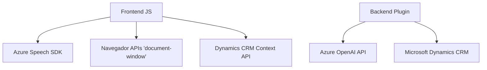

### Breve resumen técnico

El repositorio presenta una solución que combina frontend y backend para procesar datos en formularios de **Dynamics CRM** utilizando entrada de voz y capacidades de transformación de texto asistida por **Azure AI**. Los tres archivos analizados tienen funciones específicas:
1. **Frontend**: Proporciona interfaces y lógica para capturar datos desde formularios y utilizar las API del navegador junto con el SDK de Azure Speech.
2. **Backend/Plugins**: Expande Dynamics CRM mediante plugins que integran APIs como **Azure OpenAI** y proporcionan transformación avanzada de datos.

---

### Descripción de arquitectura

La solución es híbrida y consiste en:
1. **Frontend (JS)**: Modular, basado en funciones que actúan como controladores y coordinan servicios externos (SDK de Azure Speech). Los métodos están claramente delimitados por responsabilidades (lectura, síntesis de voz, transcripción).
2. **Backend (Plugin)**: Plugin monolítico para Dynamics CRM, diseñado bajo el patrón típico de extensibilidad del CRM (interfaces `IPlugin` y conexiones con APIs externas).

**Arquitectura**:
- **N capas**: Se observa una separación entre frontend (captura y visualización de datos), backend (procesamiento en Dynamics CRM) y servicios externos integrados.
- **Adaptación modular**: Integración de Azure SDKs y servicios mediante módulos que acoplan lógicamente componentes frontend y backend.
- **Integración de APIs externas**: Uso de SDKs dinámicos y servicios AI para extender funcionalidades nativas del CRM.

---

### Tecnologías usadas

1. **Frontend**:
   - **JavaScript**, APIs del navegador (`document`, `window`).
   - **Azure Speech SDK** (para síntesis de voz y transcripción).
   - **Dynamics CRM context APIs** (`formContext`, `Xrm.WebApi`).

2. **Backend**:
   - **C# para Plugins** en **Dynamics CRM SDK**.
   - **Azure OpenAI API** (para transformación de texto).
   - Extensiones .NET: 
     - `Newtonsoft.Json.Linq`.
     - `System.Net.Http`.

---

### Dependencias o componentes externos

1. **Frontend**:
   - SDK dinámico de **Azure Speech**.
   - Navegadores compatibles con ES6+. 
   - Formularios dinámicos de **Dynamics CRM**.

2. **Backend**:
   - APIs de SDK de Dynamics CRM (`IPluginExecutionContext`, `IServiceProvider`).
   - API de **Azure OpenAI** (requiere llave de configuración).
   - Tolerancia a latencia y comunicación con servicios externos (configuración de llamadas HTTP asincrónicas).
   - JSON libraries para serialización/deserialización (e.g., `Newtonsoft.Json`).

---

### Diagrama Mermaid válido para **GitHub Markdown**

---

### Conclusión final

La solución combina un enfoque de n capas con una integración modular que aprovecha servicios de Azure (Speech SDK y OpenAI). El frontend utiliza JavaScript para realizar la síntesis de voz y la transcripción de datos de formularios de Dynamics CRM, mientras que el backend implementa un patrón típico de extensión con plugins conectados a APIs externas para procesamiento avanzado mediante IA.

#### Observaciones
- **Escalabilidad**: El uso de SDKs dinámicos y la modularidad del código permiten la extensión, aunque la solución está limitada por la arquitectura de Dynamics CRM.
- **Potenciales mejoras**: Gestionar claves API y configuraciones sensibles más segura podría fortalecer la seguridad del sistema.