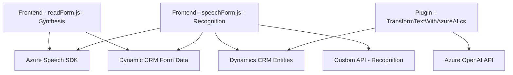

### Análisis Técnico

#### 1. Tipo de solución
La solución representa un sistema híbrido orientado a la automatización de formularios y la interacción con un CRM (Dynamics 365) utilizando funcionalidades avanzadas como reconocimiento de voz, síntesis de voz y procesamiento de texto con IA. Los componentes del repositorio se dividen entre scripts de frontend para la interacción basada en voz, y plugins backend para transformar texto con Azure OpenAI. Esto indica que el sistema es un **cliente para CRM con integración de servicios externos (API y AI)**.

#### 2. Tecnologías, Frameworks y Patrones
- **Tecnologías utilizadas:**
  - **Frontend:** JavaScript, Azure Speech SDK.
  - **Backend:** C# (.NET Framework), Dynamics 365 SDK, Azure OpenAI API.
  - **CRM APIs:** Proveen acceso y manipulación de entidades del sistema Dynamics mediante Xrm.WebApi y atributos contextuales.

- **Patrones:**
  - **Modularización:** Cada archivo encapsula funcionalidades específicas que pueden operar de forma independiente.
  - **Lazy Loading:** El SDK de Azure Speech se carga dinámicamente en el momento necesario, optimizando el uso de recursos.
  - **Facade:** Simplifica las interacciones con atributos y contexto del CRM mediante funciones auxiliares.
  - **Plugin-based Architecture:** El backend sigue el patrón nativo de extensibilidad de Dynamics 365 usando `IPlugin`.
  - **Microservicios y API-driven:** Los datos se procesan utilizando APIs externas como Azure OpenAI y Azure Speech SDK.

#### 3. Tipo de arquitectura
La arquitectura general puede clasificarse como una **arquitectura distribuida basada en n capas**:
- **Capa de presentación:** Scripts de frontend en el navegador que interactúan con los usuarios y el CRM.
- **Capa de negocio:** Plugins en el backend Dynamics que ejecutan lógica avanzada (transformación de texto, interacción con APIs).
- **Capa de servicios externos:** Integración con servicios de Azure (Speech SDK/AI).
  
Además, los plugins y scripts tienen orientación hacia un **modelo API/microservicio**, empleando servicios externos para realizar tareas específicas.

#### 4. Dependencias o componentes externos presentes
- **Azure Speech SDK:** Para reconocimiento y síntesis de voz.
- **Azure OpenAI API:** Para transformación de texto.
- **Dynamics 365 CRM APIs (Xrm.WebApi, IPluginExecutionContext):** Para operaciones relacionadas con el CRM.
- **Newtonsoft.Json:** Biblioteca para trabajar con JSON en C#.
- **Librerías nativas:** `System.Net.Http`, `System.Linq`, etc., para las operaciones básicas (como llamadas HTTP).

#### 5. Diagrama Mermaid generado

### Conclusión Final
Esta solución combina interacción con un CRM (Dynamics 365) y servicios avanzados en la nube como el reconocimiento/síntesis de voz y la IA para transformación de texto. Su diseño implementa una arquitectura distribuida basada en n capas, donde el frontend maneja la comunicación con servicios como Azure Speech SDK, y el backend utiliza plugins y servicios cloud como Azure OpenAI. Es una solución eficiente y escalable ideal para integrar funcionalidades avanzadas en entornos CRM. Sin embargo, requiere una correcta gestión de credenciales para evitar problemas de seguridad.