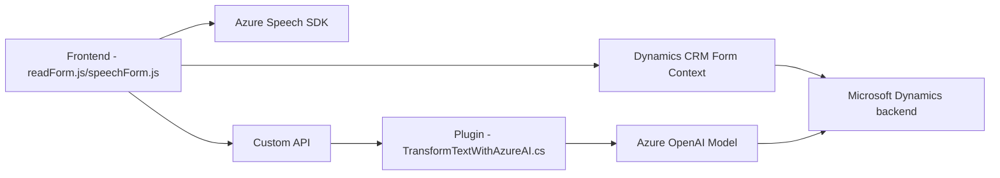

### Breve Resumen Técnico
El repositorio contiene tres archivos que forman parte de una solución orientada a la interacción entre un sistema de gestión de formularios (probablemente Microsoft Dynamics CRM), Azure Speech SDK para síntesis y reconocimiento de voz, y Azure OpenAI para procesamiento avanzado de texto. La solución permite capturar datos del usuario mediante formularios de entrada de voz/transcripción, transformarlos utilizando IA, y aplicarlos de forma automática en campos de datos de una aplicación empresarial.

---

### Descripción de Arquitectura
La arquitectura sigue un enfoque modular basado en **Microsoft Dynamics CRM**, con integración a servicios en la nube de Azure para IA y reconocimiento/síntesis de voz. Es una solución **en capas**, donde:

1. **Capa de presentación**:
   - Maneja formularios frontend usando JavaScript (archivos: `readForm.js` y `speechForm.js`) para captura y resolución de datos provenientes del reconocimiento de voz y síntesis.
2. **Capa lógica**:
   - Utiliza un plugin (`TransformTextWithAzureAI.cs`) para lógica avanzada y procesamiento de datos con Azure OpenAI Service.
3. **Capa de integración externa**:
   - Consume los servicios en la nube proporcionados por Azure (Speech SDK y OpenAI Service) para incluir capacidades avanzadas de voz e inteligencia artificial.

La arquitectura es cercana al estilo **hexagonal**, en tanto la lógica central interactúa con servicios externos definidos mediante adaptadores (Azure SDK, OpenAI Service) y puntos de entrada (Dynamics CRM plugins, SDK).

La implementación del flujo está basada en **eventos** y **callbacks**, asegurando una carga dinámica de los SDK externos y flujos controlados según condiciones específicas (como la ausencia de SDK previamente cargados).

---

### Tecnologías Usadas
1. **Frontend (JavaScript)**:
   - **Azure Speech SDK**: Para texto a voz y reconocimiento de voz.
   - **Microsoft Dynamics Form Context API**: Para manipulación dinámica de formularios.
   - **Custom API**: Extensiones personalizadas vía Dynamics CRM.

2. **Backend / Plugin**:
   - **Azure OpenAI Service**: Para procesamiento de texto avanzado basado en GPT.
   - **System.Net.Http**: Para manejo de solicitudes HTTP.
   - **Newtonsoft.Json** y **System.Text.Json**: Para manipulación de datos JSON.

3. **Plataforma**:
   - **Microsoft Dynamics CRM**: Plataforma central donde se integran componentes frontend y back-end.

---

### Diagrama Mermaid

---

### Conclusión Final
La solución es un sistema **modular y adaptable** diseñado para interacción avanzada entre interfaces de usuario basadas en **Microsoft Dynamics CRM**, procesamiento del lenguaje natural, y reconocimiento de voz. Se apoya sobre servicios de **Azure Speech SDK** y **OpenAI** para lograr una robusta interacción de inteligencia artificial. Al emplear arquitectura en capas (y algunos patrones hexagonales), el sistema optimiza la separación de responsabilidades y puede ser fácilmente extendido a nuevas funcionalidades en el futuro.