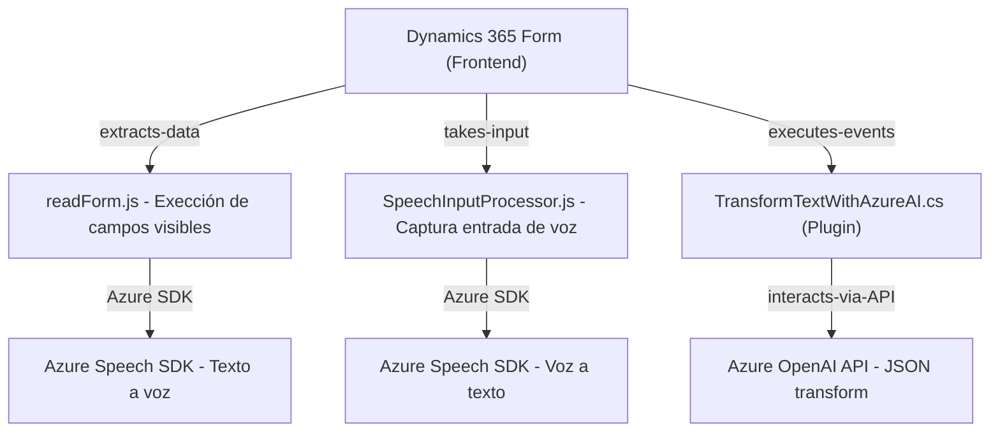

### **Breve resumen técnico**
El repositorio describe una solución integrada orientada a la interacción dinámica entre formularios de Dynamics 365 y tecnologías avanzadas como Azure Speech SDK y Azure OpenAI. Esta solución permite leer datos de un formulario, sintetizarlos como audio (frontend), capturar entrada por voz, transcribirlo (frontend), y procesar lógica avanzada mediante plugins y servicios de inteligencia artificial (backend).

---

### **Descripción de arquitectura**
La solución utiliza una arquitectura **n-capas** con integración de servicios externos. Las capas principales son:
1. **Frontend**: Procesa datos de visualización/formulario y realiza funcionalidades de síntesis de voz y captura de entrada por voz.
2. **Middleware/API Plugins**: Ejecuta procesamiento avanzado del texto (estructuración en formato JSON) mediante llamados a Azure OpenAI desde Dynamics CRM.
3. **Backend**: Lógica plugin basada en eventos de Dynamics 365, que opera como intermediario con Azure OpenAI y realiza transformaciones del texto procesado.

---

### **Tecnologías usadas**
1. **Frontend**:
   - **Azure Speech SDK**: Para síntesis de texto a voz y reconocimiento de entrada por voz.
   - **JavaScript**: Lenguaje base para el desarrollo del flujo lógico en el frontend.
   - **Dynamics 365**: Framework de datos para obtener campos visibles y actualizar formularios.

2. **Backend**:
   - **C# (.NET Framework)**: Desarrollo de plugins.
   - **Microsoft Dynamics CRM SDK**: Interactúa con el modelo de datos y eventos del sistema CRM.
   - **Azure OpenAI**: Procesa texto y lo estructura en formato JSON mediante modelos GPT avanzados.

3. **Dependencias adicionales**:
   - **System.Net.Http**: Para comunicación con servicios de Azure.
   - **Newtonsoft.Json**: Manipulación de JSON en el backend.
   - **System.Text.Json**: Serialización/deserialización de datos JSON.

---

### **Diagrama Mermaid**

---

### **Conclusión final**
Esta solución combina dinámicamente herramientas modernas de Microsoft y Azure para atender casos de uso donde los datos de formularios deben ser procesados y presentados de manera más interactiva y accesible. Con una arquitectura en capas, garantiza modularidad y escalabilidad, mientras se aprovechan servicios externos a través de patrones de integración como cliente HTTP y SDKs.