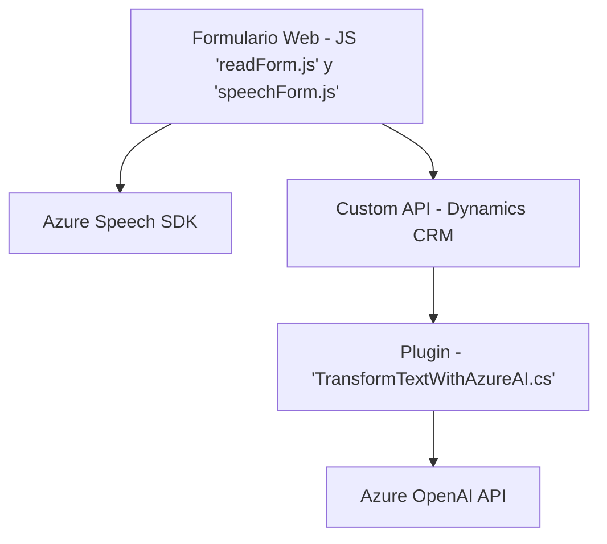

### Breve resumen técnico
El repositorio consta de tres archivos principales que se utilizan para integrar funcionalidades centradas en formularios interactivos, reconocimiento de voz y transformación de texto basado en modelos de inteligencia artificial. 

Los componentes de este sistema están distribuidos entre dos capas:
1. **Frontend (JavaScript)**: Encargado de la lógica cliente, incluyendo procesamiento de formularios, reconocimiento de voz mediante el Azure Speech SDK, y comunicación con APIs externas.
2. **Backend (C# Plugin)**: Consistente en un plugin desarrollado en .NET, que se integra con Microsoft Dynamics CRM y utiliza la API de Azure OpenAI para transformar texto según reglas predefinidas.

---

### Descripción de arquitectura
La arquitectura es de **n capas** con interacción entre capas de presentación (frontend) y lógica de negocio (plugin). Además, delega ciertas funcionalidades complejas en **servicios externos** (Azure Speech SDK y Azure OpenAI API). 

Se observan principios del diseño modular en la separación de funciones por su propósito específico. Asimismo, los patrones de arquitectura como el **Plug-in pattern** y el **Facade pattern** son evidentes.

---

### Tecnologías usadas
1. **Frontend (JavaScript)**:
   - **Azure Speech SDK**: Para el procesamiento de voz en formularios.
   - **Dynamics CRM APIs**: Para manipular datos del formulario y realizar llamadas a APIs personalizadas.

2. **Backend (C# Plugin)**:
   - **Azure OpenAI API**: Para la transformación de textos basados en IA.
   - **Microsoft Dynamics SDK**: Para integración con el sistema CRM.
   - **.NET Framework**: Desarrollo de plugins con C#.
   - **System.Net.Http / Newtonsoft.Json.Linq**: Comunicación con el API externo y manejo de datos JSON.

3. **Patrones de arquitectura**:
   - **Plug-in design**: Separación modular de funcionalidades.
   - **Facade pattern**: Integración con SDKs y servicios limitando la lógica interna.
   - **Strategy pattern**: Procesamiento diferenciado para datos generados por IA y manualmente.

---

### Diagrama Mermaid

---

### Conclusión final
Este repositorio utiliza una combinación de tecnologías de frontend y backend para mejorar la interacción y funcionalidad de formularios dinámicos en un entorno empresarial basado en Dynamics CRM. La solución emplea una arquitectura de **n capas** con fuerte dependencia en servicios externos, específicamente el **Azure Speech SDK** para procesamiento de voz y la **Azure OpenAI API** para transformación de idioma con modelos IA. La modularidad y la integración de servicios reflejan la aplicación de buenos principios de diseño, aunque los aspectos de seguridad (como evitar claves hardcodeadas) pueden ser mejorados.