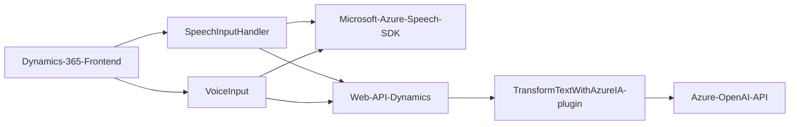

### Resumen técnico

Este repositorio parece ser parte de una solución más amplia destinada a integrar funcionalidades avanzadas de inteligencia artificial y procesamiento de voz con Microsoft Dynamics 365, utilizando servicios externos como Azure Speech SDK y Azure OpenAI. La implementación combina un frontend (JavaScript archivos), una lógica de negocio en backend (C# Plugin), y servicios adicionales proporcionados por Microsoft Azure y Dynamics.

---

### Descripción de arquitectura

**Tipo de solución**: La solución implementa servicios de procesamiento de voz y texto en una integración con Microsoft Dynamics 365. Puede clasificarse como un híbrido de integración de plataforma y API que facilita operaciones de entrada de voz y lógica empresarial avanzada.

**Tipo de arquitectura**:  
La arquitectura puede clasificarse como **N-capas** con interacción entre las capas de presentación (JavaScript para el frontend), aplicación (la lógica de negocio en el plugin de Dynamics CRM) y servicios externos en una integración **SOA (Service-Oriented Architecture)**. El patrón de plugin asegura modularidad en Dynamics 365, mientras que el uso de servicios Azure y OpenAI implica una fuerte dependencia en servicios nube externos.

---

### Tecnologías utilizadas

1. **Frontend**:
   - **Lenguaje**: JavaScript.
   - **Servicios**: Azure Speech SDK para síntesis y reconocimiento de voz.
   - **Frameworks/API**:
     - Dynamics 365 Web API (`Xrm.WebApi`) para la manipulación de datos de formularios.
   - **Patrones**:
     - Modularidad en funciones que encapsulan lógica específica.
     - Patrones como DTO (Data Transfer Object) y asincronía basada en promesas/callbacks.

2. **Backend**:
   - **Lenguaje**: C#.
   - **Servicios**:
     - Azure OpenAI para procesamiento avanzado de texto.
   - **Frameworks/API**:
     - **Microsoft.Xrm.Sdk**: Framework para desarrollo de Dynamics CRM.
     - **Newtonsoft.Json** y **System.Text.Json**: Para manejo de JSON.
     - **HttpClient** para solicitudes HTTP.
   - **Patrones**:
     - **Integración Plugin**: El diseño se adapta al modelo de Dynamics CRM basado en eventos.
     - **SOA**: Integración con servicios externos (Azure OpenAI).

---

### Dependencias o componentes externos potenciales
1. **Azure Speech SDK**:
   - Para funciones de síntesis y reconocimiento de voz.
   - Claves: `azureKey` y `azureRegion`.

2. **Azure OpenAI**:
   - Para transformación de texto en formato estructurado mediante normas personalizadas.
   - Claves: `api-key` para autenticación.

3. **Microsoft Dynamics Web API**:
   - Para interactuar con formularios y datos de Dynamics CRM.
   
4. **Bibliotecas adicionales**:
   - **Newtonsoft.Json**: Para serialización/deserialización de JSON.
   - **System.Net.Http**: Para solicitudes HTTP hacia la API de Azure OpenAI.

---

### Diagrama Mermaid

---

### Conclusión final

La solución se basa en una arquitectura de N-capas, donde las funcionalidades de frontend, backend y servicios en la nube trabajan conjuntamente para proporcionar capacidades de interacción de entradas de voz y texto estructurado a Microsoft Dynamics 365. Aprovecha las ventajas de los servicios en la nube (Azure Speech SDK y Azure OpenAI), junto con la extensibilidad de Dynamics CRM mediante plugins.

La implementación es modular y sigue patrones clásicos como el uso asincrónico, DTOs y la integración de plugins propios de Dynamics. Se observa buena separación de responsabilidades y un enfoque orientado a servicios para mantener escalabilidad, reutilización y mantenimiento del código. Este diseño es ideal para soluciones empresariales modernas integradas con IA y reconocimiento de voz.