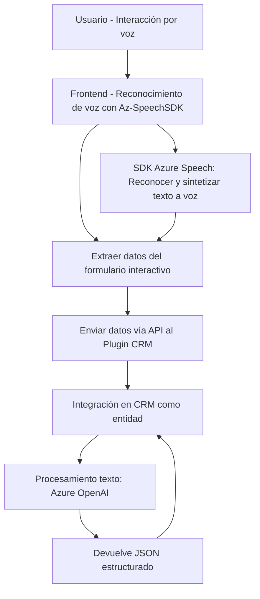

### Breve resumen técnico

Este repositorio contiene una solución que combina un sistema de frontend basado en JavaScript para interacción con formularios y reconocimiento de voz (Azure Speech SDK), complementado por un backend que implementa plugins para Microsoft Dynamics CRM y utiliza la API Azure OpenAI para transformar texto en JSON estructurado.

---

### Descripción de arquitectura

- **Tipo de solución:** Sistema híbrido donde el frontend permite interacción por voz con formularios y el backend procesa texto con lógica avanzada en función de reglas específicas. La solución se integra directamente en Microsoft Dynamics CRM.

- **Arquitectura:**  
  La solución sigue una **arquitectura de n capas**:
  - **Frontend:** Gestión de entrada por voz y interacción con formularios. Este componente utiliza Azure Speech SDK para reconocer voz y recopilar datos de los campos visibles. Funciona como capa de presentación.  
  - **Backend (Plugins):** Construido como un plugin basado en la interfaz `IPlugin` de Dynamics CRM. Responsabilidad: Convertir texto en un JSON estructurado utilizando Azure OpenAI. Actúa como capa de lógica de negocio.  
  - **Servicios externos:** Integración con Azure Speech SDK y Azure OpenAI API para funcionalidades clave.

- **Patrones destacados:**
  - **Service-Oriented Architecture (SOA):** Uso explícito de servicios como Speech SDK y OpenAI.
  - **Modularidad:** El código está claramente dividido en funciones reutilizables (tanto en frontend como backend).
  - **Event-driven:** En el frontend, callbacks manejan carga de SDK y tareas asíncronas. En el backend, el plugin solo se ejecuta cuando Dynamics lo solicita.  
  - **Clean separation:** Diferenciación entre manejo de datos en frontend y backend.

---

### Tecnologías y frameworks usados

1. **Frontend:**
   - JavaScript (modular).
   - Azure Speech SDK.
   - Microsoft Dynamics CRM SDK integrado (`formContext`).

2. **Backend (Plugins):**
   - C# (.NET Framework).
   - Microsoft Dynamics CRM SDK (`IPlugin` interface).
   - **Azure OpenAI API:** Integración directa para procesamiento avanzado de texto.
   - JSON Libraries: `System.Text.Json` y `Newtonsoft.Json.Linq`.

---

### Dependencias o componentes externos

1. **Luces:**  
   - **Azure Speech SDK:** Para reconocimiento de voz y síntesis de texto a voz en el frontend.
   - **Azure OpenAI API:** Procesamiento de texto basado en inteligencia artificial avanzada en el backend.
   - **Microsoft Dynamics CRM SDK:** Para manejar entidades, campos y lógica de negocio dentro del CRM.

2. **Bibliotecas locales:**
   - JSON handling: `System.Text.Json` y `Newtonsoft.Json.Linq`.

3. **Interfaz externa:**  
   - Plugin en backend interactúa automáticamente con el contexto del CRM.

---

### Diagrama Mermaid

---

### Conclusión final

La solución ataca dos objetivos clave: (1) proporcionar una interfaz intuitiva que incorpora reconocimiento de voz para interactuar con formularios, y (2) usar el backend para procesamiento avanzado de texto vía Azure OpenAI, mejorando la capacidad de automatización en Microsoft Dynamics CRM. Su enfoque modular y basada en servicios la convierten en una solución escalable y extensible, particularmente en entornos CRM que buscan optimizar datos mediante IA.