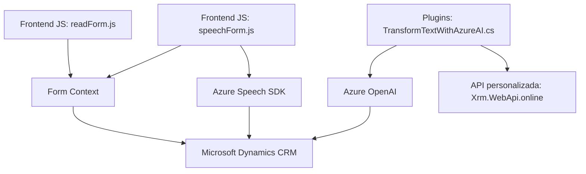

# Análisis técnico y arquitectónico del repositorio proporcionado

## Breve resumen técnico
El repositorio contiene tres archivos principales: dos archivos relacionados con la interacción en frontend (procesamiento de voz y generación de síntesis de voz directamente desde formularios en una aplicación web) y un archivo backend (.NET) que implementa un plugin de Microsoft Dynamics CRM para integrar servicios de Azure OpenAI que transforman texto en JSON estructurado. El sistema parece estar diseñado para una solución empresarial, posiblemente en el contexto de un CRM o una herramienta personalizada.

---

## Descripción de arquitectura
De acuerdo al análisis de los archivos:

1. **Solución**: La solución es un sistema híbrido que combina una integración basada en un plugin para Microsoft CRM (backend) con un componente de frontend dinámico en JavaScript. No parece ser una API ni un sistema basado en microservicios, sino una solución adaptada para entornos cliente-servidor (gestión de formularios en Microsoft Dynamics CRM).

2. **Arquitectura**: 
   - El frontend tiene una estructura de **arquitectura basada en módulos**, con funciones independientes que se organizan en torno a la interacción con formularios y el SDK de Azure Speech.
   - El backend (plugin para Dynamics CRM) sigue un patrón de **plugin de servicios**, diseñado como una capa adicional que interactúa con servicios externos (Azure OpenAI) y los datos en el entorno CRM.
   - En conjunto, la arquitectura de la solución parece estar basada en **n-capas**, donde el frontend administra la lógica de usuario y el backend gestiona la integración con servicios externos y la lógica empresarial.

3. **Tecnologías y frameworks utilizados**:
   - **Frontend**:
     - **JavaScript**: Es el lenguaje utilizado para procesar formularios y manejar SDKs.
     - **Azure Speech SDK**: Para síntesis de voz y reconocimiento de entrada por voz.
     - **Xrm.WebApi.online (CRM)**: Para realizar solicitudes web relacionadas con la plataforma CRM.
   - **Backend**:
     - **C#** con .NET Framework: Utilizado para desarrollar el plugin.
     - **API REST de Azure OpenAI**: Para realizar solicitudes POST.
     - **Microsoft Dynamics CRM SDK**: Para gestionar datos dentro de la plataforma CRM.

4. **Dependencias o componentes externos**:
   - **Servicios de Azure**:
     - Azure Speech SDK, para procesamiento de voz.
     - Azure OpenAI, para transformación de texto a estructuras JSON utilizando IA.
   - **Microsoft CRM**:
     - El entorno del CRM interactúa como una base de datos y plataforma dinámica para manejar los formularios.
   - **Componentes de SDK de terceros**:
     - Newtonsoft.Json (librería de manejo JSON) y System.Text.Json en el backend.
     - Scripts dinámicos cargados desde los endpoints de Azure en frontend.

---

## Diagrama Mermaid válido para GitHub

---

## Conclusión final
La solución se basa en una arquitectura híbrida de **n-capas**, con integración de servicios cloud ofrecidos por Azure y la plataforma de Microsoft Dynamics CRM para gestionar datos y lógica empresarial. Se observa una separación entre la funcionalidad frontend (sintetizar voz y manejar datos visibles en formularios) y backend (procesar datos con inteligencia artificial y aplicar reglas de negocio en la plataforma CRM).

Fortalezas:
- Uso de tecnologías modernas como Azure Speech SDK y OpenAI para capacidades de voz e inteligencia artificial.
- Modularidad en frontend y backend.

Limitaciones:
- Posibles vulnerabilidades relacionadas con la gestión de claves API directamente en el código fuente.
- Dependencia absoluta de servicios externos para funcionalidad crítica.

Innovación técnica:
La solución puede ser útil como parte de una plataforma CRM avanzada, permitiendo interacción natural con datos en formularios mediante voz y amplificando la productividad con IA.