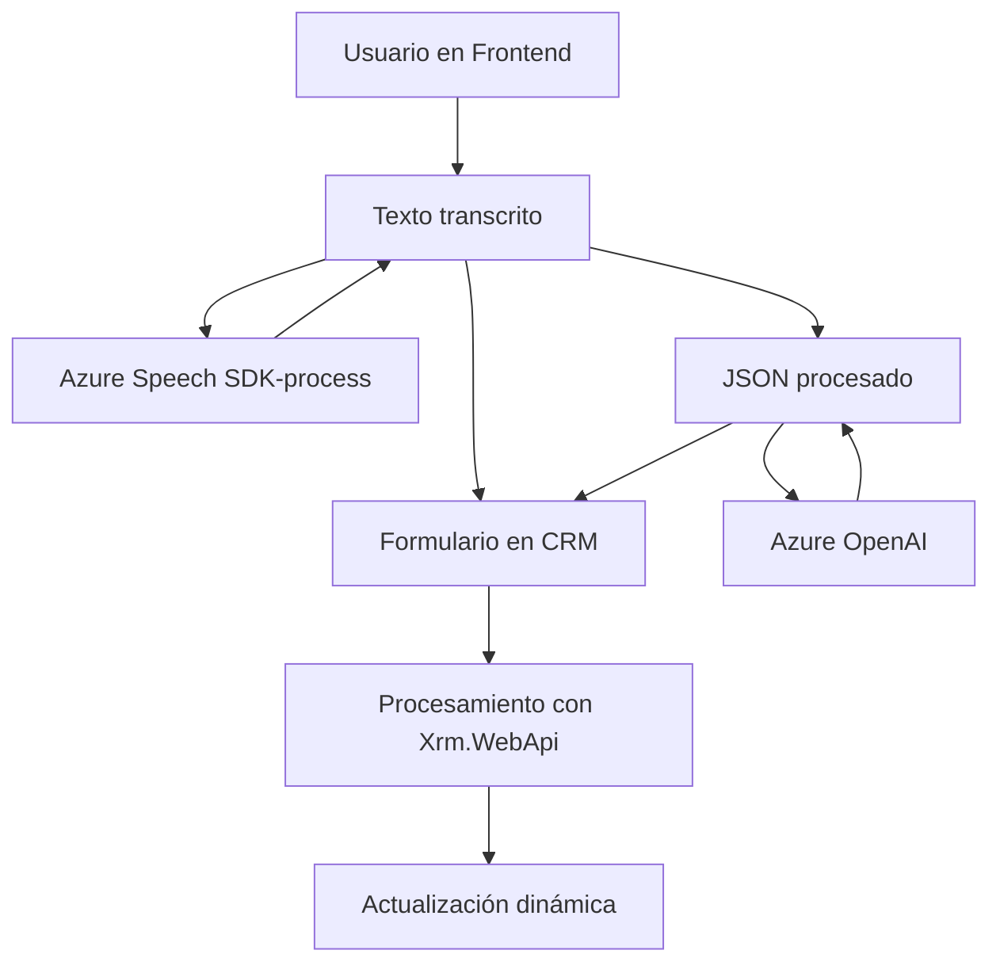

### Breve resumen técnico:

El repositorio describe una solución centrada en la interacción con formularios de un sistema CRM, extendiéndolo con servicios externos como Azure AI y Azure Speech SDK. Los componentes trabajan en conjunto para hacer lectura, procesamiento de datos, síntesis de voz y manipulación dinámica de formularios. Un plugin adicional en C# extiende estas capacidades mediante Azure OpenAI, transformando texto en estructuras JSON para el sistema.

---

### Descripción de arquitectura:

La solución tiene una arquitectura híbrida. Combina:

- **Frontend basado en módulos:** Los scripts de JavaScript independientes gestionan funciones del reconocimiento de voz y síntesis, utilizando APIs externas (Azure Speech) y están diseñados para integrarse en un entorno CRM.
- **Integración con Backend distribuido:** Un plugin de C# comunica con Azure OpenAI mediante servicios REST, apoyándose en Dynamics CRM para el contexto y ejecución. Este módulo actúa como un puente entre la tecnología cloud de Azure y la interacción dinámica del usuario.
  
Primordialmente, es una **arquitectura de n capas**, donde:
1. **Frontend:** JavaScript gestiona la interacción entre el usuario y sistemas de síntesis de voz.
2. **Lógica de capa intermedia:** Procesa datos y comandos desde el cliente y delega solicitudes a APIs externas como Azure Speech y OpenAI.
3. **Backend/Integración:** Manejo de reglas específicas a través de un plugin extensible en Dynamics CRM.

---

### Tecnologías usadas:

#### Lenguajes y SDKs:
1. **JavaScript:** Para la interacción con APIs y manipulación de formularios en el entorno CRM.
2. **C#:** Implementación del plugin extensible para Dynamics CRM.
3. **SDKs:**
   - **Azure Speech SDK:** Para síntesis y transcripción de voz.
   - **Azure OpenAI:** GPT para generación de contenido automatizado.

#### Frameworks y herramientas:
1. **Dynamics CRM APIs (`Xrm.WebApi`):** Framework usado internamente para manipulación de formularios y datos CRM.
2. **Bibliotecas:** 
   - `Newtonsoft.Json` para gestión JSON en el plugin.
   - `System.Net.Http` para consumo de APIs REST.
   
#### Patrones:
1. **Lazy Loading:** Dinámico para cargar el SDK de Azure Speech según necesidad.
2. **Cliente-servidor:** Interacción front-back mediante servicios REST.
3. **Microservicios distribuidos:** Azure Speech y OpenAI actúan como microservicios externos para síntesis de voz y AI.
4. **Módulo único de responsabilidad:** Cada función o método tiene una acción centrada y bien definida.

---

### Diagrama Mermaid válido para GitHub:

---

### Conclusión final:

Este repositorio implementa una solución funcionalmente rica y técnica que extiende las capacidades de un sistema CRM moderno. El enfoque de **n capas** brinda modularidad y escalabilidad, mientras que las integraciones con Azure ofrecen un alto nivel de automatización e interacción inteligente. Sin embargo, se podrían mejorar áreas de seguridad y maintainability, como externalizar claves/API sensibles y usar variables de entorno. Ideal para sistemas empresariales que buscan mejorar la experiencia del usuario mediante capacidades robustas de AI y voz.