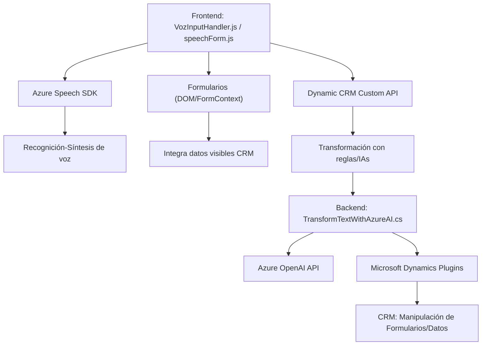

### Breve resumen técnico
El conjunto descrito de archivos en distintos niveles de un repositorio de GitHub indica una solución arquitectónica basada en la interacción entre frontend (JavaScript), plugins de Dynamics CRM (backend), y servicios de Azure (Speech SDK + OpenAI). Cada componente define funcionalidades específicas necesarias para integrar reconocimiento, síntesis de voz y procesamiento de texto dinámico conectado a un sistema CRM.

---

### Descripción de arquitectura
La arquitectura general se basa en un enfoque de **n capas** que organiza la interacción entre:
1. **Frontend (JavaScript)**: Gestiona la interfaz de usuario y su integración directa con Azure Speech SDK para reconocimiento y síntesis de voz.
2. **Plugins de Dynamics CRM (C#)**: Implementan lógica personalizada en el backend del CRM para interactuar con Azure OpenAI API y transformar texto en JSON estructurado.
3. **Integraciones externas (Azure Services)**: La solución se conecta a **Azure Speech SDK** para el manejo de audio/texto y **Azure OpenAI** para la transformación avanzada de datos.

Este diseño promueve separación de responsabilidades: frontend gestiona la interfaz, middleware (JavaScript) aplica lógica procedural, y backend (plugin) potencia la transformación en CRM mediante APIs externas.

---

### Tecnologías usadas
1. **Frontend (JavaScript)**
   - **Azure Speech SDK**: Reconocimiento y síntesis de voz a través del navegador.
   - **DOM API**: Manipulación dinámica del contenido visible y campos del formulario.

2. **Backend (C#)**
   - **Microsoft Dynamics CRM SDK**: Plugin con lógica extendida para interactuar entre el modelo de datos CRM y servicios externos.
   - **Azure OpenAI API**: Endpoint externo para procesamiento del texto transformado.
   - **System.Net.Http**: Realización de peticiones API.
   - **JSON Manipulación**:
     - `System.Text.Json` (serialización/deserialización JSON).
     - `Newtonsoft.Json` para interacción avanzada con objetos JSON.

3. **Patrones arquitectónicos**
   - **Event-driven Architecture**: Uso de callbacks para cargar SDKs dinámicos y manejar eventos asíncronos.
   - **Factory Pattern**: Creación de configuraciones del Speech SDK desde factories.
   - **Encapsulación basada en servicios**: Plugins CRM manejan instrucciones del contexto mientras abstraen configuraciones con Azure OpenAI para mayor reutilización.

---

### Posibles dependencias externas
1. **Azure Speech SDK JS**: Integra síntesis y reconocimiento en tiempo real.
2. **Azure OpenAI API**: Procesamiento avanzado, transformando texto en JSON según normas.
3. **Dynamics 365 WebAPI y Xrm SDK**: Gestión de datos dinámicos del CRM y ejecución integrada de plugins.
4. **Dependencias JS Dinámicas**: Manipulación del DOM para cargar SDK.
5. **HTTP Services**: Plugins que interactúan con APIs para transformar contenido según IA y formular datos integrados.

---

### Diagrama Mermaid compatible con GitHub Markdown

---

### Conclusión Final
La solución es una integración compleja y modular basada en la colaboración entre un frontend interactivo (en JavaScript), un backend extensible (en C# para Dynamics CRM), y múltiples servicios de Azure (Speech SDK, OpenAI API). Utiliza patrones arquitectónicos como **n capas** y principios de modularidad y desacoplamiento, asegurando extensibilidad y mantenibilidad. Ideal para implementaciones en entornos corporativos que requieren interacción con CMS como Dynamics 365.