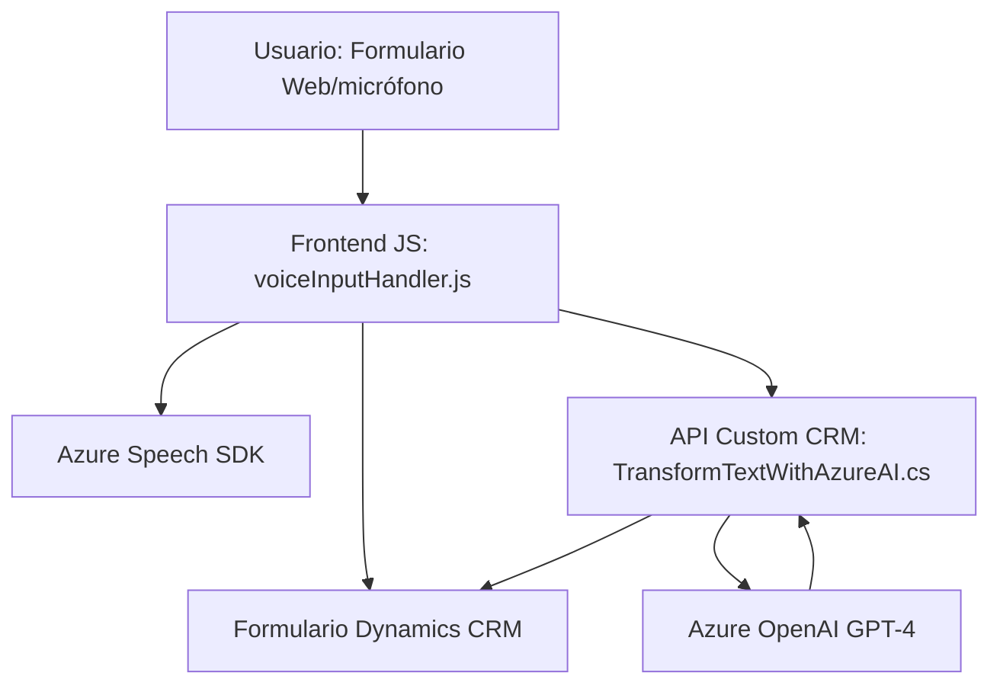

### Breve resumen técnico:
El repositorio implementa una solución integrada entre un **frontend Javascript** y una **API/plugin en .NET** para interactuar con servicios externos de **Azure Speech SDK** y **Azure OpenAI GPT-4 API**, manejando funcionalidad de entrada de voz y procesamiento del texto en sistemas de **Microsoft Dynamics CRM**. Utiliza el **Azure Speech SDK** para reconocimiento de voz y síntesis de texto a voz, junto con el procesamiento de texto mediante AI en una arquitectura de servicio modular y event-driven.

---

### Descripción de arquitectura:
La solución parece estar estructurada siguiendo una **arquitectura en n capas**:
1. **Frontend**: Implementado en Javascript, actúa como la interfaz de usuario y punto de entrada para las interacciones del cliente, como la carga de datos desde formularios y el control del flujo de entrada de voz y salida de texto hablado.
2. **Lógica de negocios**: Las operaciones relacionadas con el reconocimiento de voz, mapeo de datos, y manejo de formularios se realizan en el frontend mediante funciones bien definidas.
3. **API personalizada/plugin** (Backend): Desarrollada en C# como un plugin nativo de Microsoft Dynamics CRM (`IPlugin`), actúa como intermediario para interactuar con **Azure OpenAI API**, transformando texto en JSON según las reglas definidas y actualizando los objetos de CRM.

Esta solución, por sus componentes distribuidos y la integración con servicios de Azure, puede considerarse una arquitectura híbrida entre **microservicios** (debido a la naturaleza de las dependencias externas) y **n capas** (porque tiene una separación clara entre frontend y backend).

---

### Tecnologías usadas:
1. **Frontend**:
   - **JavaScript**: Implementación de lógica cliente y trabajo con DOM y formularios.
   - **Azure Speech SDK**: Para reconocimiento de voz y síntesis de texto a voz.
   - **Web API**: Acceso al navegador para recursos como micrófono y manejo de JSON.

2. **Backend**:
   - **C# / .NET**: Desarrollo de plugins para Microsoft Dynamics CRM.
   - **Microsoft Dynamics CRM SDK**: Para la interacción con datos del sistema de CRM.
   - **Azure OpenAI GPT-4 API**: Procesamiento de texto con IA para transformar en datos JSON estructurados.
   - **System.Net.Http**: Para comunicación HTTP con servicios externos.
   - **System.Text.Json y Newtonsoft.Json.Linq**: Manejo y parseo de datos en formato JSON (seriación/deserialización).
    
---

### Diagrama Mermaid válido para GitHub:
El diagrama describe la interacción entre los módulos y componentes de la solución.

---

### Conclusión final:
La solución es una arquitectura de **n capas** con una integración modular en la que un **frontend** y un **plugin** en el **backend** trabajan de forma colaborativa con servicios externos de Azure.  
El frontend emplea patrones de **modularidad**, **event-based architecture**, y **SDK loading** dinámico para funciones como síntesis de voz, reconocimiento de texto y manejo de formularios. El backend utiliza un **plugin** en Dynamics CRM que opera como intermediario entre el CRM y el servicio de Azure OpenAI, implementando patrones como el **service provider** y **connector**.  
Esta arquitectura puede escalar utilizando APIs adicionales o ampliándose a más herramientas de IA, pero debería fortalecerse la gestión de credenciales y la optimización de llamadas para reducir la latencia en integraciones externas.