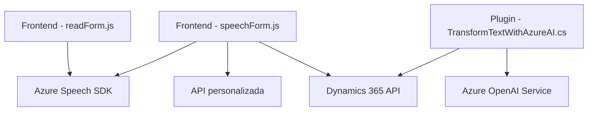

### Breve resumen técnico:
El repositorio contiene soluciones diseñadas para integrar Dynamics 365 con servicios externos, principalmente Azure Speech SDK y Azure OpenAI. Los archivos analizados revelan un enfoque modular para manipular formularios en Dynamics 365, convertir datos en voz, realizar reconocimiento de voz y transformar texto usando IA avanzada.

---

### Descripción de arquitectura:
La arquitectura general sigue un enfoque **n-capas**:
1. **Capa de presentación:** Manejada por scripts frontend en JavaScript que interactúan con Dynamics 365 para obtener datos del formulario.
2. **Capa lógica de negocio:** Plugins de Dynamics 365 y lógica personalizada en JavaScript procesan datos y los transforman (via Azure AI o APIs).
3. **Capa de integración:** Servicios externos como Azure Speech SDK y Azure OpenAI realizan las operaciones de síntesis, reconocimiento de voz y transformación de texto.
4. **Capa de datos:** Dynamics 365 maneja la persistencia de datos y los vínculos entre formularios y entidades.

---

### Tecnologías usadas:
1. **Azure Speech SDK:** Para síntesis y reconocimiento de voz.
2. **Azure OpenAI Service**: Para transformar texto según reglas predefinidas.
3. **Dynamics 365 SDK:** Para manipular formularios y datos.
4. **JavaScript:** Scripts frontend que interactúan con Dynamics 365 y los servicios mencionados.
5. **C# Plugins:** Lógica encapsulada en Dynamics para interactuar con Azure OpenAI.
6. **Newtonsoft.Json y System.Net.Http (C#):** Para manejar solicitudes HTTP y datos JSON.

---

### Diagrama **Mermaid**:

---

### Conclusión final:
El sistema en el repositorio es una solución basada en una arquitectura **n-capas** con una fuerte integración de servicios externos (Azure Speech SDK y Azure OpenAI). Está diseñado para facilitar la interacción de los usuarios con formularios dinámicos en **Dynamics 365**, mediante síntesis y reconocimiento de voz, así como transformación de datos basada en inteligencia artificial. La implementación sigue patrones como la modularidad, el uso de servicios externos y una estructura de plugins dentro de la arquitectura de Dynamics 365, destacándose por su claridad y escalabilidad.