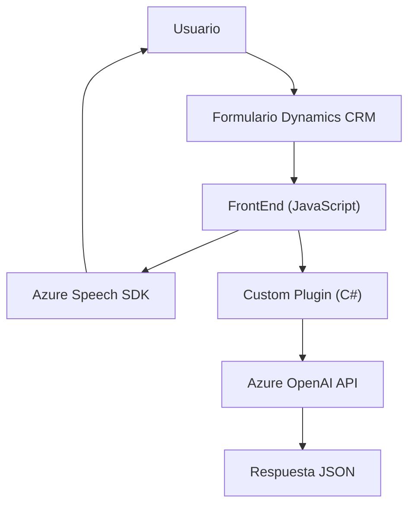

### Breve Resumen Técnico

Este repositorio contiene varios archivos interconectados que implementan soluciones para formularios interactivos en Dynamics CRM, con características de entrada y salida por voz, reconocimiento de texto, transformación mediante Azure OpenAI y consumo de APIs externas. El sistema integra múltiples tecnologías y servicios externos, con un enfoque modular y orientado a servicios.

---

### Descripción de Arquitectura

La arquitectura del proyecto combina las siguientes características:
1. **N Capas**: La solución está organizada en distintas capas de procesamiento.
    - **Frontend (JavaScript)**: Implementación para manejar la extracción de datos de formulario y salida por voz.
    - **Backend (Plugin en .NET)**: Procesamiento del texto mediante Azure OpenAI.
2. **SOA (Service-Oriented Architecture)**: Utiliza servicios especializados como el SDK de Azure Speech y Azure OpenAI para delegar responsabilidades de procesamiento.
3. **Modularidad**:
    - Cada funcionalidad se implementa bajo un archivo específico, como manejo de voz, extracción de datos y transformación de texto.
    - Métodos bien definidos con encapsulación y separación de responsabilidad.
4. **Dinámica**:
    - Carga de SDK y dependencias en tiempo de ejecución para optimizar recursos (ej. `Azure Speech SDK` se carga bajo demanda).

---

### Tecnologías Usadas

1. **Frontend**:
    - **JavaScript**: Funciones para interacción con formularios, transcripción de voz y reproducción por texto.
    - **Azure Speech SDK**: Implementado para sintetizar texto en voz y reconocer la entrada por voz.

2. **Backend**:
    - **C# (.NET Framework)**: Desarrollo del plugin core para gestionarse en Dynamics CRM.
    - **Azure OpenAI Service**: Consumo de APIs para transformar texto utilizando inteligencia artificial avanzada.
    - **Dynamics CRM SDK**: Extensiones mediante `IPlugin` para integrar lógica personalizada.

3. **Servicios Externos**:
    - **REST API**: Comunicación entre el plugin y Azure OpenAI (transformación de texto).
    - **Azure Cognitive Services Speech SDK**: Funcionalidades de texto a voz y reconocimiento de voz.

---

### Diagrama Mermaid

---

### Conclusión Final

El repositorio implementa una solución orientada a servicios, modular, y altamente dinámica que utiliza tecnologías modernas (Azure Speech SDK, OpenAI) para mejorar la accesibilidad e interacción con formularios empresariales en Dynamics CRM. La arquitectura de tipo SOA soporta servicios externos mediante integración ligera y permite una evolución futura y escalabilidad.