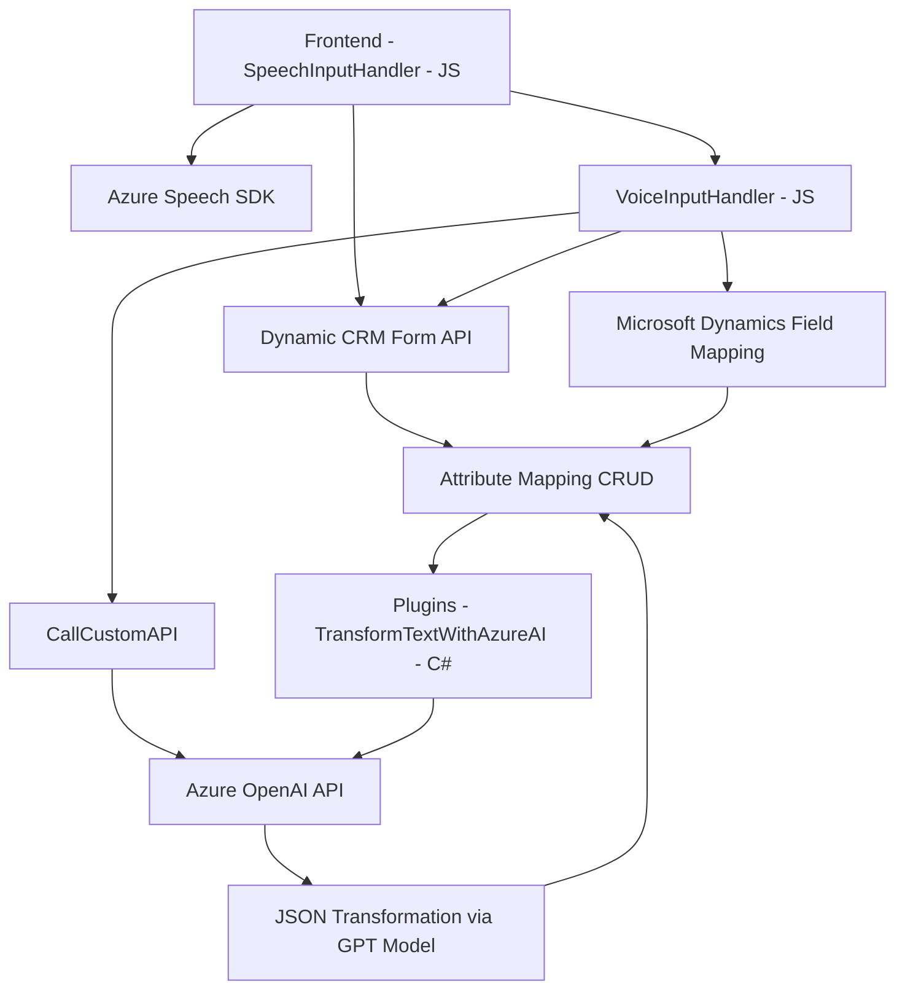

## Breve resumen técnico
El repositorio contiene varios archivos de soluciones que integran funcionalidades web y también arquitecturas de backend para trabajar con formularios en aplicaciones basadas en Dynamics CRM, procesamiento de comandos de voz con Microsoft Azure Speech SDK y texto transformado usando Azure OpenAI. La solución despliega componentes distribuidos que integran APIs externas y patrones de diseño modular orientados a eventos.

---

## Descripción de arquitectura y análisis

### 1. **Tipo de solución**
La solución es una integración híbrida que combina frontend y backend con funcionalidades orientadas a servicios. Los archivos analizados indican:
- **Frontend**: para captar datos del usuario y sintetizarlos en voz con Azure.
- **Backend plugins**: para realizar operaciones dinámicas en Dynamics CRM y procesar texto con Azure OpenAI.

### 2. **Tecnologías, frameworks y patrones utilizados**
- **Frontend**:
  - JavaScript con módulos organizados por funcionalidades específicas.
  - Integración con Microsoft Azure Speech SDK para entrada/salida de audio y síntesis de voz (TTS).
  - Dynamics 365 Web API (`Xrm.WebApi`) para manejar datos específicos del CRM.
  - Patrones:
    - **Modularidad**: Separación en funciones con responsabilidades definidas.
    - **Event-Driven Architecture**: Utiliza callbacks para manejar eventos en tiempo real (ej. carga dinámica del SDK).
    - **Service Integration**: Comunicación con servicios de texto/voz externos (Azure).

- **Backend (Plugin)**:
  - C# implementando la interfaz `IPlugin` de Dynamics 365.
  - Dependencias como `System.Net.Http`, `Newtonsoft.Json` y API de Azure OpenAI para interactuar con IA y manejar texto.
  - Uso del patrón **Plugin Architecture** típico de Dynamics CRM.
  - **API Gateway**: Comunicación entre el plugin y Azure OpenAI API para el procesamiento de texto.
  - Manejo de errores con el patrón **Exception Handling**.

### 3. **Tipo de arquitectura**
El sistema parece implementar una arquitectura híbrida basada en **n-capas**:
- **Frontend**:
  - Presentación: Manejo de entrada de imagen y voz en una capa visible al usuario.
  - Lógica: Transformación del texto usando el SDK de Azure.
  - Integración API: Comunicación directa con Azure Speech para síntesis TTS y con Dynamics 365.
- **Backend**:
  - Lógica de negocio: Reglas definidas en plugins y en las vistas de Dynamics CRM.
  - Persistencia de datos: A través de la API de Dynamics 365 se realizan las modificaciones de las entidades.

También existe una latente integración con **microservicios**, especialmente en el plugin, que actúa como un puente entre Dynamics CRM y Azure OpenAI.

### 4. **Dependencias o componentes externos presentes**
- **Microsoft Azure Speech SDK**: Para entrada y salida de audio (captura y síntesis de voz).
- **Azure OpenAI API**: Para transformar texto usando modelos avanzados de inteligencia artificial (GPT).
- **Dynamics 365 Web API**: Para manipulación CRUD de entidades del CRM (que es la capa persistente del sistema).
- **Paquetes de C# para datos y comunicación**: Como `Newtonsoft.Json`, `System.Net.Http`, y otros de infraestructura.
- **Interna**:
  - Métodos, servicios y datos específicos del CRM.
  - Patrones de implementación modular y eventos.

---

## Diagrama Mermaid válido para GitHub Markdown

Este diagrama muestra los principales componentes de la solución y sus interacciones.

---

## Conclusión final

La solución presentada realiza una integración avanzada entre un frontend con funcionalidades API y un backend para procesamiento y persistencia de datos en sistemas CRM. Las tecnologías utilizadas (Azure Speech SDK, OpenAI API, Dynamics 365 SDK) la convierten en un ejemplo de conexión orquestada entre servicios y aplicaciones, liderada por patrones de modularidad y delegación de responsabilidades específicas. Aunque funcional, la arquitectura podría evolucionar hacia una arquitectura de microservicios para mejorar la desacoplamiento, escalabilidad y mantenibilidad.