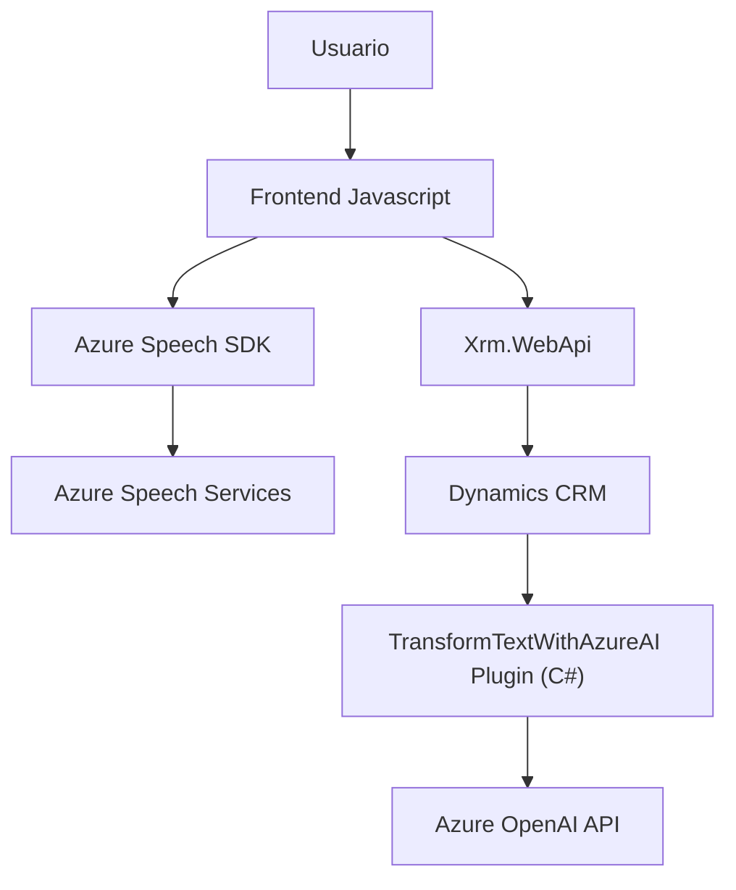

### Breve resumen técnico:
El repositorio descrito es parte de una solución híbrida multifrontal para gestionar interacción por voz y texto con formularios mediante APIs de Dynamics CRM y servicios de Azure (Speech SDK y OpenAI). La solución incluye archivos JavaScript para frontend (integración dinámica con formularios via Azure Speech SDK) y un plugin en C# que opera como un componente servidor dentro de Dynamics CRM con conectividad a Azure OpenAI.

---

### Descripción de arquitectura:
El sistema utiliza arquitectura de **n-capas** con integración de servicios externos. La capa de presentación usa scripts JavaScript para interactuar con datos de formularios y permiten funcionalidades como síntesis/reconocimiento de voz. La lógica empresarial se implementa en un plugin de Dynamics CRM (en la capa intermedia) que utiliza Azure OpenAI para transformar datos y retornar resultados. Las capas están bien desacopladas y utilizan patrones consistentes como modularización, integración de SDKs y programación asincrónica/event-driven en la capa frontend.

La solución tiene características de arquitectura **modular**, ya que cada componente tiene funciones específicas (e.g., voz en scripts y procesamiento del plugin). No obstante, está principalmente centralizada en torno al Dynamics CRM, con conexión a servicios externos mediante APIs.

---

### Tecnologías usadas:
1. **Frontend:**
   - **JavaScript:** Base para manipulación del DOM y la lógica de integración con Dynamics CRM.
   - **Microsoft Dynamics CRM SDK (Xrm.WebApi):** Permite interactuar con los datos del formulario de Dynamics desde el navegador.
   - **Azure Speech SDK:** Usado para reconocimiento y síntesis de voz.
   - **Patrones:** Modularización, Event-driven y Dynamic Script Loading.

2. **Backend:**
   - **C#:** Desarrollo del plugin `TransformTextWithAzureAI`.
   - **Microsoft Dynamics CRM Plugin Framework:** Implementa `IPlugin` para desarrollos personalizados.
   - **Azure OpenAI:** Conexión mediante REST API para realizar procesamiento de texto con GPT-4.
   - **Tecnologías relevantes de .NET:** 
     - System.Net.Http para realizar peticiones HTTP.
     - System.Text.Json para manejo de JSON.

---

### Diagrama Mermaid válido para GitHub:

---

### Conclusión final:
La solución descrita es una **integración de n-capas** que conecta funcionalidades frontend interactivas con backend basado en plugins, utilizando el ecosistema de Microsoft Dynamics CRM y los servicios externos de Azure Speech y Azure OpenAI. Su arquitectura es efectiva y modular, permitiendo una alta configurabilidad y extensibilidad para futuras funcionalidades.

- Recomendación: Aunque existe modularización adecuada, se podría optimizar aún más el plugin dividiendo la lógica auxiliar en clases y métodos separados. También sería ideal incluir controles adicionales para robustez en la interacción con los SDKs y APIs externos (por ejemplo, retries en las peticiones HTTP al Azure OpenAI).