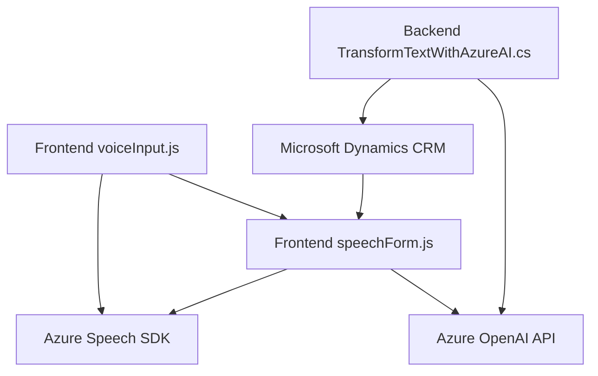

### Breve Resumen Técnico
La solución programada está diseñada para integrar reconocimiento de voz, síntesis de texto a voz y procesamiento de texto con servicios en la nube como **Azure Speech SDK** y **Azure OpenAI**, específicamente en el contexto de aplicaciones relacionadas con **Microsoft Dynamics**. Consta de varios componentes que habilitan interactividad dinámica mediante entrada por voz, manipulación de formularios en tiempo real, y transformación semántica avanzada de texto.

---

### Descripción de Arquitectura
Este sistema refleja una **arquitectura de servicios distribuidos integrada a aplicaciones CRM**. Los archivos analizados cumplen roles específicos:
1. **Frontend (JavaScript)**: Gestionan la captura de entrada de voz, integración con **Azure Speech SDK**, y manipulación de DOM para formularios dinámicos.
2. **Backend (Plugin)**: Implementa un plugin de Dynamics CRM que utiliza **Azure OpenAI API** para transformar texto.
3. **Servicios Externos Integrados**: Los componentes interactúan con servicios en la nube (Azure AI y Speech SDK) para procesamiento de datos, alineándose con el patrón de **integración de servicios externos**.

---

### Tecnologías, Frameworks y Patrones Usados
1. **Frameworks y Librerías**:
   - **JavaScript**: Para la gestión del frontend y llamadas al servicio externo de Azure SDK.
   - **Microsoft Dynamics CRM Plugin SDK**: Permite la creación de plugins personalizados mediante la interfaz `IPlugin`.
   - **Azure Speech SDK**: Para reconocimiento de voz y síntesis de texto a voz.
   - **Azure OpenAI API**: Para transformación avanzada de texto basado en GPT.
   - **System.Net.Http**, **Newtonsoft.Json**: Para realizar solicitudes y manipular mensajes JSON desde el backend del plugin.

2. **Patrones de Arquitectura**:
   - **Modularidad Funcional**: Cada archivo tiene funciones y métodos que encapsulan roles específicos.
   - **Event-driven**: Uso de callbacks para procesar eventos como la transcripción de voz y la carga del SDK.
   - **Plugin Architecture**: Integración directa con CRM mediante un módulo especializado (plugin).
   - **Service-Oriented Architecture**: Dependencia en APIs externas para funcionalidades avanzadas como IA y procesamiento de datos.

3. **Dependencias Externas**:
   - **Azure Speech SDK**: Para realizar síntesis y transcripción de voz.
   - **Azure OpenAI API**: Transformación del texto.
   - **Microsoft Dynamics CRM SDK**: Para integración nativa.
   - **HTTP Client Libraries (System.Net.Http)**: Para realizar solicitudes HTTP hacia servicios remotos.
   - **JSON Libraries (System.Text.Json, Newtonsoft.Json)**: Serialización y deserialización.

---

### Diagrama Mermaid 100% Compatible con GitHub Markdown

---

### Conclusión Final
La solución analizada construye una arquitectura de integración entre servicios de Microsoft Dynamics CRM y Azure Cloud for AI. Los componentes están organizados de forma modular y funcionalmente cohesionada: el frontend gestiona entrada, salida y transformación de datos basados en voz usando **Azure Speech SDK**, mientras que el plugin backend interactúa directamente con Dynamics CRM y servicios de IA externos (**Azure OpenAI API**) para la transformación avanzada de texto estructurado.

La arquitectura utiliza patrones modernos como **event-driven**, **service-oriented**, y **plugin-based architectures**. Esto facilita escalabilidad, modularidad y reutilización. El sistema está diseñado para aplicaciones específicas en entornos empresariales que priorizan el procesamiento dinámico de datos y la integración con servicios inteligentes basados en la nube.