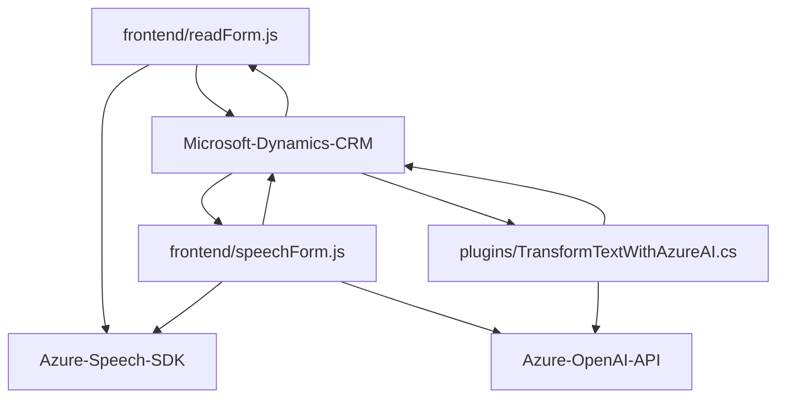

### Breve resumen técnico
Este repositorio contiene un sistema basado en **Microsoft Dynamics CRM**, Azure Speech SDK y Azure OpenAI, diseñado para gestionar formularios, interactuar mediante comandos de voz, y procesar texto con inteligencia artificial. Combina funcionalidades de reconocimiento de voz, síntesis de voz, manipulación de datos de formularios y servicios externos para enriquecer la experiencia de usuario.

---

### Descripción de arquitectura
1. **Tipo de solución**: Principalmente una solución híbrida enfocada en extender Dynamics CRM, compuesta por archivos de frontend en **JavaScript** para la integración cliente y un plugin backend en **C#** para extensiones del CRM.
2. **Arquitectura**: La arquitectura es de tipo **n capas**:
   - **Frontend**: Archivo JavaScript modular con lógica de negocio para reconocimiento y síntesis de voz, y manipulación de formularios.
   - **Middleware**: Dinámica mediante el consumo de servicios de Azure Speech SDK y una API personalizada.
   - **Backend (Plugin)**: Código C# que implementa un plugin para realizar operaciones en Dynamics CRM mediante la integración con Azure OpenAI.
   
---

### Tecnologías usadas
1. **Frontend**:
   - **JavaScript (ES6)**: Funciones asíncronas, manipulación del DOM, promesas (async/await).
   - **Azure Speech SDK**: Comunicación con servicios de reconocimiento y síntesis de voz.
   - **Dynamics CRM Web API (Xrm.WebApi)**: Manipula registros del CRM para actualizar formularios.

2. **Backend**:
   - **C# (.NET)**: Implementación del plugin utilizando la estructura de Dynamics CRM.
   - **Dynamics SDK & APIs**: `Microsoft.Xrm.Sdk` y `Newtonsoft.Json.Linq` para manipulación JSON y automatización en Dynamics CRM.
   - **Azure OpenAI API**: Procesamiento de texto con capacidades de inteligencia artificial.

3. **General**:
   - **HTTP/REST APIs**: Comunicación entre los clientes y servicios externos.
   - **Modularización**: Separación de responsabilidades en funciones específicas, tanto en el frontend como en el backend, siguiendo el principio de responsabilidad única (SRP).

---

### Diagrama Mermaid
El diagrama muestra una perspectiva simplificada de la interacción entre componentes:

---

### Conclusión final
Esta solución implementa una **n capas** estructurada con una fuerte integración entre **Azure Speech SDK** y **Azure OpenAI**, conectándose eficientemente con Dynamics CRM para enriquecer formularios mediante comandos activados por voz y texto transformado. El diseño modular del código fomenta la escalabilidad y la reutilización, mientras que los patrones de carga dinámica y encapsulación de lógica aseguran una separación clara de responsabilidades y gran compatibilidad con el ecosistema CRM.

Tiene un enfoque moderno y flexible, aprovechando herramientas cognitivas de Azure y estándares actuales de desarrollo web y backend.