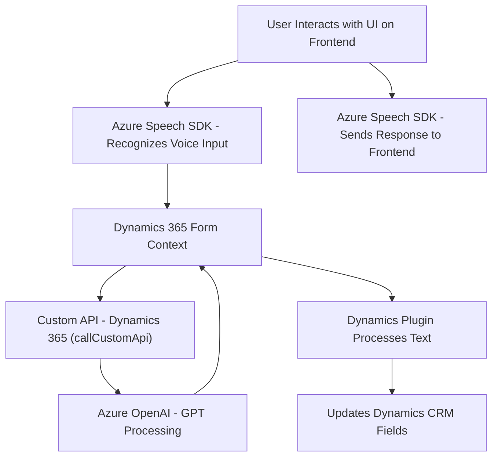

### Breve Resumen Técnico
Este repositorio contiene la implementación de una solución híbrida que combina múltiples componentes: un sistema de **frontend** en JavaScript, una **integración con servicios externos (Azure Speech SDK y Azure OpenAI)**, y un backend basado en **Microsoft Dynamics 365 CRM plugin architecture**. Los módulos en JavaScript gestionan la interfaz de usuario y la entrada de voz; el plugin en C# extiende las capacidades del sistema, transformando datos usando AI.

---

### Descripción de la Arquitectura
La arquitectura utilizada es una **n capas con integración de servicios externos**:
1. **Frontend (Interfaz de Usuario)**: Implementado en JavaScript, con componentes para la interacción de usuarios y la entrada-salida de datos (voz y texto).
2. **API de Servicios Externos**:
   - **Azure Speech SDK**: Con procesamiento para síntesis y reconocimiento de voz.
   - **Azure OpenAI API**: Procesamiento avanzado de texto mediante IA.
3. **Backend (Plugins)**: Los plugins en C# se ejecutan en el contexto de Dynamics CRM para extenderlo mediante lógica personalizada.
4. **Servicios en Microarquitectura (Dynamics Custom APIs)**: La solución incluye invocaciones API personalizadas basadas en Dynamics 365 y modelos empresariales.

El flujo conecta servicios externos (Azure Speech SDK y OpenAI) con formularios interactivos generados en Dynamics CRM para reconocimiento de voz, modificación de datos y respuesta audible.

---

### Tecnologías Usadas
1. **Frontend**:
   - JavaScript (ES6).
   - **Azure Speech SDK**: Para síntesis y reconocimiento de voz.
   - Dynamics 365 SDK: Integra formularios, Web APIs y contexto de ejecución.

2. **Backend**:
   - C# para los plugins con Microsoft Dynamics SDK (`Microsoft.Xrm.Sdk`).
   - **Azure OpenAI API** (GPT models).
   - Libraries: `Newtonsoft.Json`, `System.Text.Json` for JSON parsing.

---

### Diagrama Mermaid

---

### Conclusión Final
La solución es claramente una **hybrid multi-layer architecture** que combina un frontend para entrada y salida de voz, un componente de procesamiento de texto en Dynamics CRM, integración con API externas (Azure Speech SDK y OpenAI), y la arquitectura de plugins de Dynamics CRM. Los desarrolladores han implementado principios de modularidad y separación de responsabilidades, lo que hace que el sistema sea flexible y escalable.

#### Detalles adicionales:
- Este sistema combina software de usuario final (frontend), middleware (Dynamics Custom APIs), y backend (Dynamics CRM plugins) con deep integrations into external cloud computing services (Azure Speech, Azure OpenAI).  
- Modern patterns like **Client-Server**, **Plugin Pattern**, **API-Oriented Architecture**, and **Service Oriented Architecture (SOA)** emerge in its design.  

Esta estructura es un buen ejemplo de cómo optimizar experiencias en Dynamics CRM mediante servicios cognitivos basados en nube y procesamiento de datos eficiente.