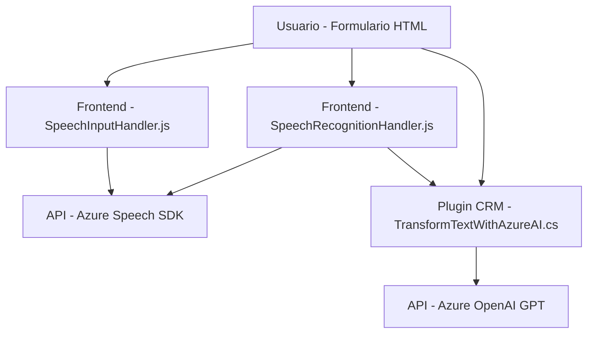

## Análisis técnico del repositorio

### Breve resumen técnico
El repositorio presenta una solución que integra funcionalidades de síntesis y reconocimiento de voz mediante Azure Speech SDK en el frontend, junto con extensiones para Microsoft Dynamics CRM utilizando un plugin personalizado que conecta dinámicamente con Azure OpenAI Service. La estructura combina accesibilidad en formularios HTML y procesamiento avanzado del lenguaje natural a través de componentes backend.

---

### Descripción de arquitectura
1. La solución incorpora:
   - Módulos de frontend que interactúan con usuarios usando reconocimiento de voz y síntesis con Azure Speech SDK.
   - Un plugin como extensión de CRM que transforma texto con inteligencia artificial (Azure OpenAI).
2. Arquitectura:
   - **Frontend:** Modular y funcional, con integración directa al servicio Azure Speech SDK. Siguiendo una estructura lógica estilo **n capas**: capa de presentación (formulario), capa lógica para procesamiento de texto/voz, y capa de integración externa.
   - **Backend:** Plugin para Dynamics CRM basado en una metodología **orientada a eventos** que actúa en los contextos del sistema (acciones CRUD y eventos pre/post en CRM).
   - **Conexiones:** Microservicio de reconocimiento/síntesis de voz y microservicio de transformación de texto (API Azure OpenAI).

---

### Tecnologías y patrones usados
#### Tecnologías:
- **Frontend (JavaScript):**
  - **Speech SDK** de Azure: Reconocimiento y síntesis de voz.
  - Integración con formularios HTML dinámicos.
- **Backend (Dynamics CRM):**
  - **Microsoft.Xrm.Sdk**: Extensiones para CRM interno.
  - **Azure OpenAI Service**: Procesamiento de lenguaje natural.
  - **Newtonsoft.Json** y **System.Text.Json**: Manipulación de JSON.
  - **HttpClient**: Interacciones REST.
  
#### Patrones:
- **Patrón Modular:** Código del frontend estructurado para dividir responsabilidades. Cada función sirve propósitos específicos (lectura de formulario, extracción de datos, síntesis, mapping).
- **Facade:** Abstracción inicial a través de una única función principal (`startVoiceInput`) para simplificar la experiencia del desarrollador.
- **Capa de servicios:** Interacción directa mediante APIs externas como Speech SDK de Azure y OpenAI.
- **Event-driven Plugin:** Plugin CRM que utiliza contextos predefinidos de eventos (según la interfaz de Microsoft Dynamics CRM).

---

### Dependencias externas y componentes presentes
1. **Frontend:**
   - **Azure Speech SDK**: API para procesamiento de voz.
   - Servicios de síntesis y reconocimiento en la nube de Azure.
2. **Backend:**
   - **Azure OpenAI Service:** Modelo de lenguaje (GPT-4 personalizado).
   - **Newtonsoft.Json** y **System.Text.Json**: Gestión JSON.
   - **Dynamics CRM SDK**: Interfaz de extensibilidad de Microsoft Dynamics.

---

### Diagrama **Mermaid** para representar interacciones del sistema

---

### Conclusión final
Este repositorio presenta una solución híbrida con arquitectura **n capas** en el frontend y uso de **microservicios** en el backend para extensiones de Dynamics CRM. Las capas del frontend interactúan con servicios modernos de síntesis/reconocimiento de voz y se integran mediante SDK de Azure. En el backend, un plugin utiliza Azure OpenAI para ofrecer procesamiento avanzado basado en IA. El diseño es modular y sigue prácticas contemporáneas de integraciones externas, pero sería aconsejable mejorar la seguridad de credenciales y evitar dependencias redundantes en JSON.