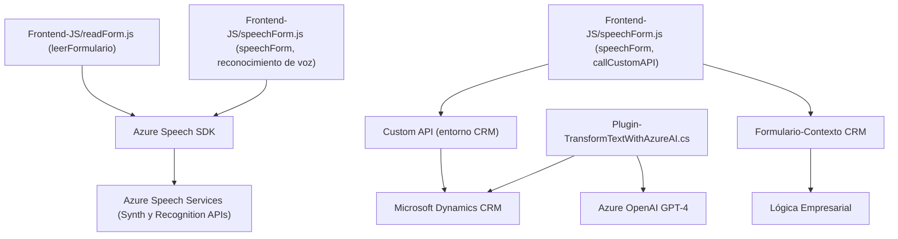

# Análisis detallado del repositorio y respuesta técnica:

### Breve Resumen Técnico:
El repositorio parece estar compuesto de tres partes principales:
1. **Frontend/JS/readForm.js**: Archivo JavaScript que implementa la funcionalidad de lectura de campos visibles en formularios y sintetiza voz mediante Azure Speech SDK.
2. **Frontend/JS/speechForm.js**: Archivo JavaScript que habilita el ingreso de datos de formularios mediante reconocimiento de voz (Azure Speech SDK).
3. **Plugins/TransformTextWithAzureAI.cs**: Plugin desarrollado en C#, que trabaja específicamente en el contexto de Microsoft Dynamics CRM, utilizando Azure OpenAI para transformar texto en JSON estructurado.

---

### Descripción de Arquitectura:
La solución tiene una arquitectura híbrida que combina elementos de **microservicios**, **orientación a eventos**, y **plataformas externas de APIs**:
1. La interacción directa con **Azure APIs (Speech SDK y OpenAI)** define un patrón de **integración con servicios externos**, actuando como un gateway que conecta la aplicación interna (Dynamics CRM y los formularios) con servicios avanzados de inteligencia artificial.
2. La funcionalidad del frontend se organiza en funciones modulares y escalables que trabajan con un enfoque de **n capas**, separando claramente las responsabilidades:
   - Capa de entrada: usando Azure Speech Recognition SDK para capturar la entrada de voz.
   - Capa de lógica: procesamiento de datos, validación y eventos.
   - Capa de salida: síntesis de voz y manipulación del frontend (como la aplicación de valores a formularios).
3. La integración con Microsoft Dynamics CRM mediante plugins implementados con la interfaz `IPlugin` aprovecha **plugin architecture**, y el manejo de dependencias a través de `IServiceProvider` ejemplifica el uso de **dependency injection**.
4. Adopta elementos del diseño **serverless & event-driven** en la integración con Azure APIs y la arquitectura de reconocimiento y síntesis de voz.
5. Utiliza **estilo funcional** en los archivos JavaScript con funciones independientes y reutilizables, asegurando un diseño modular.

---

### Tecnologías y Frameworks Usados:
1. **Frontend (JavaScript):**
   - **Azure Speech SDK** para reconocimiento y síntesis de voz.
   - Uso de tecnologías nativas del navegador: DOM API y event listeners.
   - Dynamic dependencies loading: La carga del Azure Speech SDK se hace de forma dinámica según las necesidades de ejecución.
   - Promesas y funciones asíncronas: La arquitectura del código en frontend utiliza funciones asíncronas y promesas para interactuar con APIs que tienen llamadas remotas.

2. **Backend (Microsoft CRM Plugin en C#):**
   - **Azure OpenAI API (GPT-4, GPT-4o)** para procesamiento semántico inteligente del texto.
   - **Microsoft Dynamics CRM SDK** para desarrollo de plugins y manejo de la lógica empresarial.
   - **Newtonsoft.Json** y **System.Text.Json** para procesamiento y serialización de objetos JSON.
   - **System.Net.Http** para realizar solicitudes HTTP hacia servicios RESTful.

3. **Arquitectura:**
   - **n capas + integración con servicios externos**: Utiliza claramente separaciones en diferentes capas funcionales, con interacción con proveedores externos como Azure.

---

### Análisis de Componentes externos:
1. **Azure Speech SDK**: Utilizado en archivos JavaScript para síntesis y reconocimiento de voz.
2. **Azure OpenAI API**: Utilizado en el plugin de C# para acceder a servicios de inteligencia artificial.
3. **Xrm.WebApi**: Utilizado como API interna para el acceso a datos de Microsoft Dynamics CRM.
4. **Microsoft Dynamics CRM SDK**: Facilitación de la integración como un plugin con servidores CRM.
5. **Newtonsoft.Json**: Procesamiento y manipulación JSON en C#.
6. **Browser DOM API**: Para manipulación directa de los elementos del DOM en el frontend.

---

### Diagrama Mermaid para representar la arquitectura

---

### Conclusión Final:
El diseño general de la solución combina buena modularidad, patrones funcionales y orientados a eventos en el frontend con un enfoque robusto de integración externa y capacidades de procesamiento externo en el backend. La elección de Azure Speech SDK y Azure OpenAI muestra un ecosistema alineado con la nube y preparado para manejar soluciones de IA y voz intensivas. La solución puede calificarse como **orientada a servicios (microservicios)**, con un estilo complementario de integración de **n capas** entre frontend, APIs y backend.

Aunque el repositorio tiene un diseño sólido, se sugiere una mejor parametrización de los servicios en archivos de configuración y el uso explícito de manejo detallado de errores en el plugin para asegurar una integración más robusta.